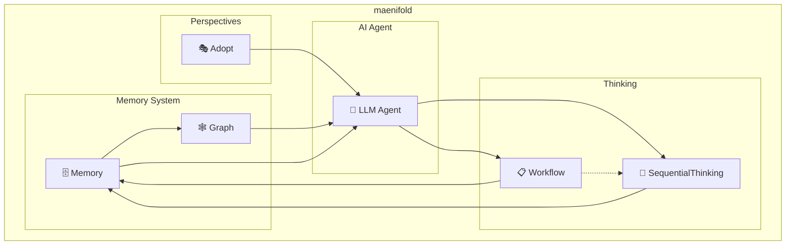

<p align="center">
  
</p>

<p align="center">
  Your AI is ephemeral. Your knowledge shouldn't be.
</p>

<p align="center">
  <a href="https://www.npmjs.com/package/maenifold"></a>
  <a href="https://github.com/msbrettorg/maenifold/blob/main/LICENSE"></a>
  <a href="https://insiders.vscode.dev/redirect/mcp/install?name=maenifold&config=%7B%22type%22%3A%22stdio%22%2C%22command%22%3A%22npx%22%2C%22args%22%3A%5B%22-y%22%2C%22maenifold%22%2C%22--mcp%22%5D%2C%22env%22%3A%7B%22MAENIFOLD_ROOT%22%3A%22~%2Fmaenifold%22%7D%7D"></a>
  <a href="https://insiders.vscode.dev/redirect/mcp/install?name=maenifold&config=%7B%22type%22%3A%22stdio%22%2C%22command%22%3A%22npx%22%2C%22args%22%3A%5B%22-y%22%2C%22maenifold%22%2C%22--mcp%22%5D%2C%22env%22%3A%7B%22MAENIFOLD_ROOT%22%3A%22~%2Fmaenifold%22%7D%7D"></a>
</p>

## What maenifold does

**maenifold** enhances AI agents with persistent graphs of thought that compound over time.  Every tool creates `[[WikiLink]]` connections that survive conversations. Every session builds on the last. Knowledge compounds instead of resets.  **It transforms ephemeral AI sessions into continuous collective intelligence.**

<p align="center">
  
</p>

[Our demo](assets/demo-artifacts/README.md) shows this at scale: 25 AI agents across 68 minutes discovered a critical production bug not through programmed coordination, but through emergent understanding. No orchestration code was written, yet agents perfectly orchestrated themselves across 4 waves, building on each other's discoveries through a shared knowledge graph.

The critical move operation bug emerged from the intersection of multiple test patterns seen across different agent sessions - something no single agent could have found alone. This is maenifold's core: making every AI session additive rather than isolated.

### How it worked:

- Agents shared discoveries through `[[WikiLinks]]` in memory files
- Each wave of agents built on previous findings via search and context traversal
- The critical bug emerged from patterns across multiple test sessions
- 171,506 new concept relationships were created, connecting discoveries
- [Full orchestration logs](assets/demo-artifacts/part1-pm-lite/orchestration-session.md) and [test results](assets/demo-artifacts/part1-pm-lite/E2E_TEST_REPORT.md) available

85% test success rate. Real production bug found. Zero orchestration code written.

That's what maenifold does: It provides the substrate (WikiLinks, memory, graph) and steps back. Intelligence fills the space.

## Cognitive Assets

maenifold ships with 54 pre-configured cognitive frameworks that agents can adopt dynamically:

### 🔄 **28 Workflows** - Structured Methodologies
From reasoning patterns to development processes:
- **Reasoning**: deductive, inductive, abductive, critical, strategic, higher-order thinking
- **Creative**: design thinking, divergent thinking, lateral thinking, oblique strategies, SCAMPER
- **Development**: agentic-dev with anti-slop controls, agile, SDLC, code review workflows
- **Collaborative**: world café, parallel thinking, six thinking hats
- **Meta-orchestration**: workflow-dispatch for intelligent methodology selection

### 🎭 **7 Roles** - Professional Perspectives
Each with personality, principles, and transition triggers:
- **Product Manager**: "Simple, Lovable, Complete" framework
- **Architect**: System design and patterns
- **Engineer**: Implementation and quality
- **Researcher**: Investigation and discovery
- **Writer**: Clear communication
- **Red Team**: Security testing and adversarial thinking
- **Blue Team**: Defense and protection strategies

### 🎨 **7 Colors** - De Bono's Six Hats + Gray
Thinking modes for different cognitive approaches:
- **White**: Facts and information
- **Red**: Emotions and intuition
- **Black**: Caution and critical judgment
- **Yellow**: Optimism and positive assessment
- **Green**: Creativity and alternatives
- **Blue**: Process control and orchestration
- **Gray**: Skeptical inquiry and assumption questioning

### 🗣️ **12 Perspectives** - Sapir-Whorf Linguistic Patterns
Language-influenced cognitive styles based on linguistic relativity:
- **Arabic**: Pattern analysis through root systems
- **Japanese**: Contextual and relational thinking
- **German**: Hierarchical precision
- **And 9 more**: Each language brings unique reasoning patterns

These aren't just templates - they're cognitive substrates that combine with the knowledge graph to create emergent reasoning capabilities. An agent can start with strategic thinking, switch to red team perspective when finding vulnerabilities, then adopt the writer role to document findings - all while building on the persistent knowledge graph.

##  The Cognitive Stack

### Tool Relationships



### Reasoning Layer (Tools + Workflows) - Where Information is Processed

Where test-time computation happens:
- **Test-time Adaptive Reasoning**: Sequential thinking with revision, branching, persistence and automatic graph construction
- **Perspective Tuning**: Rich role and color (six thinking hats) definitions provide tunable agent perspectives
- **Intelligent Workflow Selection**: Meta-cognitive system that analyzes problems and selects optimal reasoning approaches
- **30 Distinct Methodologies**: Complete taxonomy from deductive reasoning to design thinking, with sophisticated orchestration
- **Assumption Ledger**: Traceable skepticism for agent reasoning—capture, validate, and track assumptions without auto-inference
- **Multi-agent Coordination**: Wave-based execution with parallel agent dispatch with 'blue-hat' product manager orchestrating sub-agents (claude-code/codex/aishell/etc...)


### Memory Layer (`memory://`) - Where Data is Stored

- **Local**: Every piece of knowledge lives as a markdown file on disk with a unique URI.
- **Transparent**: Every thought, revision, and decision visible in markdown files.
- **Human-Friendly**: All files are human-readable, Obsidian-compatible, and persist across sessions.


### Graph Layer (SQLite + vectors) - Where Knowledge Emerges

Automatic graph construction from `[[WikiLinks]]` with:
- **384-dimensional embeddings** for semantic similarity
- **Edge weights** that strengthen with repeated mentions
- **Concept clustering** revealing emergent patterns
- **Incremental sync** keeping the graph current
- **Hybrid RRF Search**: Semantic + full-text fusion for optimal retrieval (not just embedding similarity)
- **Graph Construction**: No schema, no ontology — structure emerges from WikiLink usage

## Technical Specifications

- **Language**: C# with .NET 9.0
- **Vector Dimensions**: 384 (all-MiniLM-L6-v2 via ONNX)
- **Search Algorithm**: Reciprocal Rank Fusion (k=60)
- **Database**: SQLite with vector extension
- **Graph Sync**: Incremental with file watching
- **Memory Format**: Markdown with YAML frontmatter
- **URI Scheme**: `memory://` protocol
- **Tested Scale**: > 1.1 million relationships
- **MCP Compliance**: Full tool annotation support

## Quick start

### Install
```bash
npm install -g maenifold
```

### MCP Interface

**Claude Code, Continue, Cline** - Add to MCP config:

```json
{
  "mcpServers": {
    "maenifold": {
      "command": "maenifold",
      "args": ["--mcp"],
      "env": {"MAENIFOLD_ROOT": "~/maenifold"}
    }
  }
}
```

**Codex** - Add to `~/.codex/config.toml`:

```toml
[mcp_servers.maenifold]
type = "stdio"
command = "maenifold"
args = ["--mcp"]
startup_timeout_sec = 120
tool_timeout_sec = 600
env = { MAENIFOLD_ROOT = "~/maenifold" }
```

Try it: `"Write a memory about our architecture decisions"`

### CLI Interface

Use maenifold directly in scripts, pipelines, or with non-MCP clients:

```bash
# Write a memory with WikiLinks
maenifold --tool WriteMemory --payload '{
  "title": "Architecture Decisions",
  "content": "Our [[microservices]] use [[event-sourcing]] for [[audit-trails]]"
}'

# Continue a sequential thinking session
maenifold --tool SequentialThinking --payload '{
  "sessionId": "session-1234567890",
  "response": "After analyzing the architecture...",
  "nextThoughtNeeded": true
}'

# Search memories with hybrid mode
maenifold --tool SearchMemories --payload '{
  "query": "authentication patterns",
  "mode": "Hybrid",
  "pageSize": 10
}'
```

**MCP and CLI have full feature parity.** Start a session via MCP and continue it via CLI, or vice versa. The system supports concurrent agents using the same memory location - perfect for multi-agent pipelines or parallel workflows.

## Learn more

- [Complete Documentation](assets/README.md) - Architecture, examples, philosophy
- [Demo Artifacts](assets/demo-artifacts/README.md) - Multi-agent orchestration

.NET 9.0 · SQLite · ONNX · MCP · MIT License

---

## Stargazers over time

[](https://starchart.cc/msbrettorg/maenifold)
