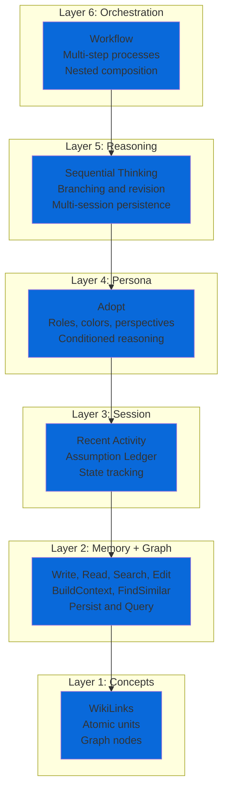
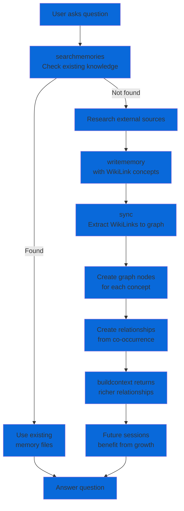

<p align="center">
  
</p>

<p align="center">
  Your AI is ephemeral. Your knowledge shouldn't be.
</p>

<p align="center">
  <a href="https://github.com/msbrettorg/maenifold/releases/latest"></a>
  <a href="https://github.com/msbrettorg/maenifold/blob/main/LICENSE"></a>
</p>

## What is maenifold?

**maenifold** is a knowledge graph for AI agents. Every conversation creates `[[WikiLink]]` connections that survive sessions. Every thought builds on the last. Knowledge compounds instead of resetting.

It transforms ephemeral AI sessions into continuous collective intelligence.

<p align="center">
  
</p>

## The Problem

AI agents are brilliant in the moment but forget everything after each conversation. Teams of agents can't build on each other's work. Discoveries vanish. Patterns go unnoticed. Every session starts from zero.

## The Solution

maenifold gives AI agents a persistent memory through knowledge graphs:

- **Write once, remember forever** - Knowledge lives in markdown files with `[[WikiLinks]]`
- **Automatic connections** - Graph relationships emerge from how concepts appear together
- **Smart retrieval** - Hybrid search combines semantics and full-text for optimal recall
- **Compound knowledge** - Later sessions benefit from all previous work automatically

Think of it as giving your AI a brain that keeps learning across sessions, projects, and even across different AI systems.

## See It in Action

Our [multi-agent demo](docs/demo-artifacts/README.md) proves this at scale: 25 AI agents across 68 minutes discovered a critical production bug through emergent collaboration. No orchestration code. No pre-programmed coordination. Just agents building on shared knowledge.

**What happened:**
- Agents wrote discoveries using `[[WikiLinks]]` in memory files
- Each wave built on previous findings through graph traversal
- Bug emerged from patterns across multiple test sessions
- 171,506 concept relationships created, connecting discoveries

**Results:**
- 85% test success rate
- Real production bug found
- Zero orchestration code written

[Full orchestration logs](docs/demo-artifacts/part1-pm-lite/orchestration-session.md) · [Test results](docs/demo-artifacts/part1-pm-lite/E2E_TEST_REPORT.md)

## Quick Start

### Installation

**Recommended: Claude Code Plugin**

```bash
claude plugin install msbrettorg/maenifold
```

This automatically configures the MCP server, installs skills, and sets up context injection hooks.

**Alternative: Manual Install**

macOS/Linux (Homebrew):
```bash
brew install msbrettorg/tap/maenifold
```

Windows (Zip Archive):

Download `maenifold-win-x64.zip` from [GitHub Releases](https://github.com/msbrettorg/maenifold/releases/latest), extract to `%LOCALAPPDATA%\Programs\Maenifold`, and add to PATH. See [installation guide](integrations/skills/maenifold/README.md#windows-zip-archive) for details.

Verify installation:
```bash
maenifold --version
```

### First Steps

After installation, try these in Claude Code:

```
Write a memory about [[architecture]] decisions

Search memories for authentication patterns

Build context around the concept [[testing]]
```

## Skills

Skills are how you interact with maenifold. They expose tools, workflows, and orchestration patterns.

### Maenifold Skill (Core)

Provides memory, graph, and reasoning tools.

**What you get:**
- 25+ tools for memory and graph operations
- 6-layer cognitive stack (Concepts → Orchestration)
- Sequential thinking with branching
- 32 structured workflows
- Assumption tracking

[📖 Installation & Architecture Guide →](integrations/skills/maenifold/README.md)

### Product Manager Skill (Orchestration)

Multi-agent coordination system with hooks and quality gates.

**What you get:**
- 8 concurrent agent slots (SWE, red-team, blue-team, researcher)
- Automatic graph context injection
- ConfessionReport quality enforcement
- Sprint lifecycle with full traceability (PRD → RTM → TODO)

[🎯 Installation & Architecture Guide →](integrations/skills/product-manager/README.md)

## How It Works

### The Cognitive Stack

maenifold operates as a 6-layer composition architecture where higher layers invoke lower layers:



**Layer 1: Concepts** - Every `[[WikiLink]]` becomes a graph node

**Layer 2: Memory + Graph** - Persist and query knowledge with hybrid search

**Layer 3: Session** - Track state and assumptions across interactions

**Layer 4: Persona** - Condition reasoning through roles and perspectives

**Layer 5: Reasoning** - Enable branching, revision, multi-day persistence

**Layer 6: Orchestration** - Compose all layers into structured workflows

Complexity emerges from composition, not bloated tools.

### Knowledge Graph Growth



The graph isn't static. Every interaction grows it. Knowledge compounds over time, creating institutional memory that persists across all sessions.

## Cognitive Assets

maenifold includes 32 workflows, 16 roles, 7 thinking colors, and 12 linguistic perspectives that agents can adopt and compose.

### Workflows

_32 structured methodologies for problem-solving and analysis_

**Thinking & Reasoning** (12)
| Workflow | Description |
|----------|-------------|
| 💭 Abductive Reasoning | Systematic hypothesis formation through inference to best explanation |
| 💭 Convergent Thinking | Systematic analysis and selection of the single best solution |
| 💭 Critical Thinking | Systematic evaluation, analysis, and logical assessment |
| 💭 Data Thinking | User-centric systematic approach to data strategy |
| 💭 Deductive Reasoning | Top-down logical inference from general principles |
| 💭 Design Thinking | Human-centered approach to innovation |
| 💭 Divergent Thinking | Systematic generation of multiple creative alternatives |
| 💭 Higher-Order Thinking | Meta-cognitive reflection and complex reasoning |
| 💭 Inductive Reasoning | Bottom-up inference from specific observations |
| 💭 Lateral Thinking | Creative problem-solving through indirect approaches |
| 💭 Parallel Thinking | Simultaneous exploration of multiple perspectives |
| 💭 Strategic Thinking | Long-term competitive positioning and analysis |

**Multi-Agent Orchestrated** (4)
| Workflow | Description |
|----------|-------------|
| 🔬 Advanced Research Agent | Sophisticated research with HyDE enhancement and reflexion loops |
| 🌊 Agentic SLC Sprint | Multi-agent sprint execution using synchronized waves |
| ♟️ Game Theory Strategic Analysis | Parallel agent waves for equilibrium finding |
| 🏛️ Research Think Tank | Orchestrated knowledge construction through collaboration |

**Development Methodologies** (4)
| Workflow | Description |
|----------|-------------|
| 🔄 Agile Methodology | Iterative and incremental approach |
| 🎯 Agentic SLC | AI agent-assisted development with anti-slop controls |
| 🚀 Lean Startup | Build-measure-learn approach |
| 🔧 Software Development Lifecycle | Systematic development phases |

**Creative Problem Solving** (3)
| Workflow | Description |
|----------|-------------|
| 🎲 Oblique Strategies | Random creative prompts to break mental blocks |
| 💥 Provocative Operation | Deliberate provocations to escape conventional thinking |
| 🎨 SCAMPER Method | Creative problem-solving using 7 prompts |

**Structured Problem Solving** (2)
| Workflow | Description |
|----------|-------------|
| 🐛 Debug Your Reasoning | Expose broken assumptions and flawed reasoning |
| 📐 Pólya Problem Solving | George Pólya's four-step approach |

**Collaborative Processes** (2)
| Workflow | Description |
|----------|-------------|
| 🎩 Six Thinking Hats | Structured thinking using six perspectives |
| ☕ World Café | Collaborative dialogue leveraging diverse roles |

**FinOps** (2)
| Workflow | Description |
|----------|-------------|
| 💵 FinOps Data Collection | Pull cost data from Microsoft FinOps hubs |
| 💵 FinOps Strategic Analysis | Executive-grade insights with industry benchmarks |

**Business Strategy** (1)
| Workflow | Description |
|----------|-------------|
| ⏰ Compelling Reason to Act | Framework for creating urgency |

**Meta/System** (2)
| Workflow | Description |
|----------|-------------|
| 👤 Constitutional Role Architecture | Create specialist roles using constitutional AI |
| 🎮 Workflow Dispatch | Intelligent cognitive strategy selection |

### Roles

_16 specialized personas for domain expertise_

**FinOps**: Chief Financial Officer, FinOps Practitioner, FinOps Hub Query Executor

**EDA**: Silicon Architect, Platform Operator

**AI**: Prompt Architect, GPT-5 Prompt Architect, GPT-5-Codex Prompt Architect

**Software**: Architect, Engineer, MCP Protocol Specialist, Product Manager, Red Team, Blue Team

**Research**: Researcher, Writer

### Thinking Colors

_7 perspectives from Edward de Bono's Six Thinking Hats_

| Color | Focus |
|-------|-------|
| ⚫ Black | Critical Thinking |
| 🎭 Blue | Orchestrator |
| 🔘 Gray | Skeptical Inquiry |
| 🟢 Green | Creative Thinking |
| 🔴 Red | Emotions & Intuition |
| ⚪ White | Facts & Information |
| 🟡 Yellow | Positive Thinking |

### Linguistic Perspectives

_12 native language modes for culturally-aware reasoning_

🇸🇦 Arabic · 🇩🇪 German · 🇬🇧 English · 🇪🇸 Spanish · 🇫🇷 French · 🇮🇹 Italian · 🇯🇵 Japanese · 🇰🇷 Korean · 🇵🇹 Portuguese · 🇷🇺 Russian · 🇹🇷 Turkish · 🇨🇳 Chinese

## Configuration

### MCP Setup (Manual Install Only)

If you installed via plugin, skip this section.

**Claude Code**

Add to `.mcp.json` in your project:

```json
{
  "mcpServers": {
    "maenifold": {
      "command": "maenifold",
      "args": ["--mcp"],
      "type": "stdio"
    }
  }
}
```

**Claude Desktop**

Edit configuration at:
- macOS: `~/Library/Application Support/Claude/claude_desktop_config.json`
- Windows: `%APPDATA%\Claude\claude_desktop_config.json`

```json
{
  "mcpServers": {
    "maenifold": {
      "command": "maenifold",
      "args": ["--mcp"]
    }
  }
}
```

On Windows, if you didn't add maenifold to PATH, use the full path to the extracted executable:
```json
{
  "mcpServers": {
    "maenifold": {
      "command": "%USERPROFILE%\\maenifold\\bin\\maenifold.exe",
      "args": ["--mcp"]
    }
  }
}
```

**Codex CLI**

Edit `~/.codex/config.toml`:

```toml
[mcp_servers.maenifold]
type = "stdio"
command = "maenifold"
args = ["--mcp"]
startup_timeout_sec = 120
tool_timeout_sec = 600
```

### Custom Data Directory

Set the `MAENIFOLD_ROOT` environment variable:

```bash
# Bash/Zsh
export MAENIFOLD_ROOT=~/my-knowledge-base

# PowerShell
$env:MAENIFOLD_ROOT = "$HOME\my-knowledge-base"
```

Or in MCP configuration:

```json
{
  "mcpServers": {
    "maenifold": {
      "command": "maenifold",
      "args": ["--mcp"],
      "type": "stdio",
      "env": {
        "MAENIFOLD_ROOT": "~/my-knowledge-base"
      }
    }
  }
}
```

## CLI Interface

Use maenifold directly in scripts, pipelines, or with non-MCP clients:

```bash
# Write a memory with WikiLinks
maenifold --tool WriteMemory --payload '{
  "title": "Architecture Decisions",
  "content": "Our microservices use event-sourcing for audit-trails"
}'

# Continue a sequential thinking session
maenifold --tool SequentialThinking --payload '{
  "sessionId": "session-1234567890",
  "response": "After analyzing the architecture...",
  "nextThoughtNeeded": true
}'

# Search memories with hybrid mode
maenifold --tool SearchMemories --payload '{
  "query": "authentication patterns",
  "mode": "Hybrid",
  "pageSize": 10
}'
```

MCP and CLI have full feature parity. Start a session via MCP and continue via CLI, or vice versa. Perfect for multi-agent pipelines.

## Technical Specifications

- **Language**: C# with .NET 9.0
- **Vector Dimensions**: 384 (all-MiniLM-L6-v2 via ONNX)
- **Search Algorithm**: Reciprocal Rank Fusion (k=60)
- **Database**: SQLite with vector extension
- **Graph Sync**: Incremental with file watching
- **Memory Format**: Markdown with YAML frontmatter
- **URI Scheme**: `memory://` protocol
- **Tested Scale**: > 1.1 million relationships
- **MCP Compliance**: Full tool annotation support

## Documentation

- [Maenifold Skill Guide](integrations/skills/maenifold/README.md) - Core tools and architecture
- [Product Manager Skill Guide](integrations/skills/product-manager/README.md) - Multi-agent orchestration
- [Complete Documentation](docs/README.md) - Deep dive into philosophy and design
- [Demo Artifacts](docs/demo-artifacts/README.md) - Multi-agent example with logs
- [GitHub Releases](https://github.com/msbrettorg/maenifold/releases) - Download binaries

## Community

maenifold is open source under the MIT License.

Contributions welcome at [github.com/msbrettorg/maenifold](https://github.com/msbrettorg/maenifold).

---

## Stargazers over time

[](https://starchart.cc/msbrettorg/maenifold)
