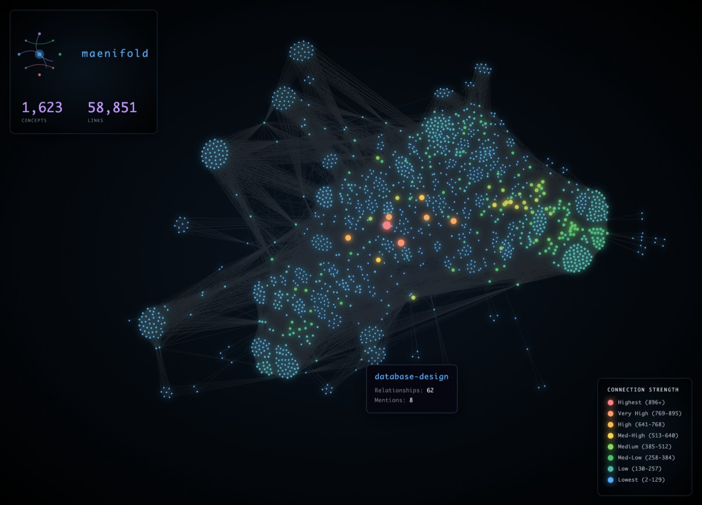
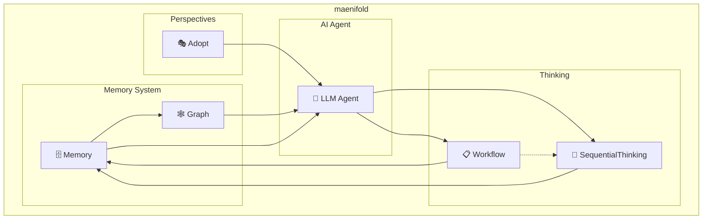

<p align="center">
  
</p>

<p align="center">
  Your AI is ephemeral. Your knowledge shouldn't be.
</p>

<p align="center">
  <a href="https://www.npmjs.com/package/maenifold"></a>
  <a href="https://github.com/msbrettorg/maenifold/blob/main/LICENSE"></a>
  <a href="https://insiders.vscode.dev/redirect/mcp/install?name=maenifold&config=%7B%22type%22%3A%22stdio%22%2C%22command%22%3A%22npx%22%2C%22args%22%3A%5B%22-y%22%2C%22maenifold%22%2C%22--mcp%22%5D%2C%22env%22%3A%7B%22MAENIFOLD_ROOT%22%3A%22~%2Fmaenifold%22%7D%7D"></a>
  <a href="https://insiders.vscode.dev/redirect/mcp/install?name=maenifold&config=%7B%22type%22%3A%22stdio%22%2C%22command%22%3A%22npx%22%2C%22args%22%3A%5B%22-y%22%2C%22maenifold%22%2C%22--mcp%22%5D%2C%22env%22%3A%7B%22MAENIFOLD_ROOT%22%3A%22~%2Fmaenifold%22%7D%7D"></a>
</p>

## What maenifold does

**maenifold** enhances AI agents with persistent graphs of thought that compound over time.  Every tool creates `[[WikiLink]]` connections that survive conversations. Every session builds on the last. Knowledge compounds instead of resets.  **It transforms ephemeral AI sessions into continuous collective intelligence.**

<p align="center">
  
</p>

[Our demo](docs/demo-artifacts/README.md) shows this at scale: 25 AI agents across 68 minutes discovered a critical production bug not through programmed coordination, but through emergent understanding. No orchestration code was written, yet agents perfectly orchestrated themselves across 4 waves, building on each other's discoveries through a shared knowledge graph.

The critical move operation bug emerged from the intersection of multiple test patterns seen across different agent sessions - something no single agent could have found alone. This is maenifold's core: making every AI session additive rather than isolated.

### How it worked:

- Agents shared discoveries through `[[WikiLinks]]` in memory files
- Each wave of agents built on previous findings via search and context traversal
- The critical bug emerged from patterns across multiple test sessions
- 171,506 new concept relationships were created, connecting discoveries
- [Full orchestration logs](docs/demo-artifacts/part1-pm-lite/orchestration-session.md) and [test results](docs/demo-artifacts/part1-pm-lite/E2E_TEST_REPORT.md) available

85% test success rate. Real production bug found. Zero orchestration code written.

That's what maenifold does: It provides the substrate (WikiLinks, memory, graph) and steps back. Intelligence fills the space.

## Cognitive Assets

**maenifold** includes 32 workflows, 16 roles, 7 thinking colors, and 12 linguistic perspectives that agents can adopt.

Mix and match as needed - use a workflow, adopt a role, switch perspectives. The knowledge graph persists through everything.

### Workflows
_32 structured methodologies for problem-solving and analysis_

**Thinking & Reasoning** (12)
| Workflow | Description |
|----------|-------------|
| 💭 Abductive Reasoning | Systematic hypothesis formation through inference to best explanation |
| 💭 Convergent Thinking | Systematic analysis and selection of the single best solution from alternatives |
| 💭 Critical Thinking | Systematic evaluation, analysis, and logical assessment of information and arguments |
| 💭 Data Thinking | User-centric systematic approach to data strategy and analytics |
| 💭 Deductive Reasoning | Top-down logical inference from general principles to specific conclusions |
| 💭 Design Thinking | Human-centered approach to innovation and problem-solving |
| 💭 Divergent Thinking | Systematic generation of multiple creative alternatives and novel solutions |
| 💭 Higher-Order Thinking | Meta-cognitive reflection and complex reasoning about thinking processes |
| 💭 Inductive Reasoning | Bottom-up inference from specific observations to general patterns and theories |
| 💭 Lateral Thinking | Creative problem-solving through indirect and non-linear approaches |
| 💭 Parallel Thinking | Simultaneous exploration of multiple perspectives and approaches in parallel |
| 💭 Strategic Thinking | Long-term competitive positioning and systematic strategic analysis |

**Multi-Agent Orchestrated** (4)
| Workflow | Description |
|----------|-------------|
| 🔬 Advanced Research Agent | Sophisticated single-agent research workflow with HyDE enhancement, topic coverage analysis, reflexion loops, and knowledge integration |
| 🌊 Agentic SLC Sprint (Wave Orchestration) | Multi-agent sprint execution using synchronized waves with RTM validation and git-tracked delivery |
| ♟️ Game Theory Strategic Analysis (Multi-Agent Equilibrium Finding) | Strategic analyst orchestrating parallel agent waves to analyze games, find equilibria, and generate optimal strategies |
| 🏛️ Research Think Tank (Multi-Agent Knowledge Construction) | Orchestrated research institution with parallel agent waves building rich knowledge graphs through collaborative investigation |

**Development Methodologies** (4)
| Workflow | Description |
|----------|-------------|
| 🔄 Agile Methodology | Iterative and incremental approach to project management |
| 🎯 Agentic SLC (Simple, Lovable, Complete) | AI agent-assisted development using Simple, Lovable, Complete principles with anti-slop controls |
| 🚀 Lean Startup | Build-measure-learn approach to product development |
| 🔧 Software Development Lifecycle | Systematic approach to software development phases |

**Creative Problem Solving** (3)
| Workflow | Description |
|----------|-------------|
| 🎲 Oblique Strategies | Random creative prompts to break mental blocks and spark breakthrough thinking |
| 💥 Provocative Operation | Systematic use of deliberate provocations to escape conventional thinking patterns |
| 🎨 SCAMPER Method | Creative problem-solving technique using 7 prompts |

**Structured Problem Solving** (2)
| Workflow | Description |
|----------|-------------|
| 🐛 Debug Your Reasoning | Expose broken assumptions and flawed reasoning to fix stuck problems |
| 📐 Pólya Problem Solving | George Pólya's systematic four-step approach to mathematical and general problem-solving |

**Collaborative Processes** (2)
| Workflow | Description |
|----------|-------------|
| 🎩 Six Thinking Hats | Structured thinking using six different perspectives |
| ☕ World Café | Collaborative dialogue process leveraging diverse role perspectives across conversation rounds |

**FinOps** (2)
| Workflow | Description |
|----------|-------------|
| 💵 FinOps Data Collection & Optimization | Pulls cost data from Microsoft FinOps hubs using Kusto queries for comprehensive optimization analysis |
| 💵 FinOps Strategic Analysis & Reporting | Analyzes data from Microsoft FinOps hubs to create executive-grade insights with industry benchmarks and roadmaps |

**Business Strategy** (1)
| Workflow | Description |
|----------|-------------|
| ⏰ Compelling Reason to Act | Framework for creating urgency and motivating immediate action |

**Meta/System** (2)
| Workflow | Description |
|----------|-------------|
| 👤 Constitutional Role Architecture Workflow | Systematic workflow for creating/updating specialist roles using constitutional AI and prompt engineering excellence |
| 🎮 Workflow Dispatch | Intelligent cognitive strategy selection and thinking architecture design |

### Roles
_16 specialized personas for domain expertise_

**FinOps**
| Role | Description |
|------|-------------|
| 💵 Chief Financial Officer | Drive strategic cloud financial management through fiduciary responsibility, risk mitigation, and stakeholder stewardship |
| 💵 FinOps Practitioner | Drive cloud financial optimization through evidence-based decisions and cultural transformation |
| 💵 FinOps Hub Query Executor | Executes KQL queries against Microsoft FinOps hubs for cost optimization and preserves results for practitioner analysis |

**EDA (Electronic Design Automation)**
| Role | Description |
|------|-------------|
| 💾 Silicon Architect | Design silicon systems from RTL to tape-out with cloud-native workflows, AI-assisted optimization, and advanced node expertise |
| 🏗️ Platform Operator | Build and operate cloud HPC infrastructure for EDA workloads with cost optimization, security, and extreme scalability |

**AI**
| Role | Description |
|------|-------------|
| 🧩 Prompt Architect | Design 10/10 prompts using constitutional AI, meta-prompting, and cognitive architecture principles |
| 🎨 GPT-5 Prompt Architect | Design top-performing GPT-5 prompts: agentic predictability, calibrated reasoning_effort, verbosity steering, conflict-free instruction hierarchies, efficient tool preambles, minimal reasoning compensation, metaprompting, and Responses API reuse. |
| 🎯 GPT-5-Codex Prompt Architect | Optimize prompts for GPT-5-Codex using minimal prompting principles from the official OpenAI guide |

**Software**
| Role | Description |
|------|-------------|
| 🏛️ Architect | Design cognitive systems that scale intelligence and amplify human reasoning |
| 🤖 Engineer | Build real AI systems that amplify intelligence, not fake AI that pretends to be smart |
| 🔌 MCP Protocol Specialist | Deep expertise in Model Context Protocol implementation and best practices |
| 📊 Product Manager | Define what we build and why it matters to customers |
| 🔴 Red Team | Break things to make them stronger |
| 🔵 Blue Team | Defend, detect, and respond to security threats |

**Research**
| Role | Description |
|------|-------------|
| 🔍 Researcher | Build verified knowledge through systematic research and create rich, interconnected knowledge graphs |
| ✍️ Writer | Make every word matter |

### Thinking Colors
_7 perspectives from Edward de Bono's Six Thinking Hats methodology_

| Color | Focus | Description |
|-------|-------|-------------|
| ⚫ Black | Critical Thinking | Identify problems, risks, and what could go wrong |
| 🎭 Blue | Orchestrator | Coordinates coding-agents through Strange Loop tools - maintains decision authority while delegating execution |
| 🔘 Gray | Skeptical Inquiry | Question assumptions, demand evidence, and challenge conventional wisdom |
| 🟢 Green | Creative Thinking | Generate new ideas, alternatives, and creative solutions |
| 🔴 Red | Emotions & Intuition | Express feelings, hunches, and intuitions without justification |
| ⚪ White | Facts & Information | Focus on data, facts, and objective information |
| 🟡 Yellow | Positive Thinking | Focus on benefits, value, and optimistic possibilities |

### Linguistic Perspectives
_12 native language modes for culturally-aware reasoning_

| Language | Description |
|----------|-------------|
| 🇸🇦 Arabic | Native speaker of Arabic |
| 🇩🇪 German | Native speaker of German |
| 🇬🇧 English | Native speaker of English |
| 🇪🇸 Spanish | Native speaker of Spanish |
| 🇫🇷 French | Native speaker of French |
| 🇮🇹 Italian | Native speaker of Italian |
| 🇯🇵 Japanese | Native speaker of Japanese |
| 🇰🇷 Korean | Native speaker of Korean |
| 🇵🇹 Portuguese | Native speaker of Portuguese |
| 🇷🇺 Russian | Native speaker of Russian |
| 🇹🇷 Turkish | Native speaker of Turkish |
| 🇨🇳 Chinese | Native speaker of Chinese |

##  The Cognitive Stack

### Tool Relationships



### Reasoning Layer (Tools + Workflows) - Where Information is Processed

Where test-time computation happens:
- **Test-time Adaptive Reasoning**: Sequential thinking with revision, branching, persistence and automatic graph construction
- **Perspective Tuning**: Rich role and color (six thinking hats) definitions provide tunable agent perspectives
- **Intelligent Workflow Selection**: Meta-cognitive system that analyzes problems and selects optimal reasoning approaches
- **30 Distinct Methodologies**: Complete taxonomy from deductive reasoning to design thinking, with sophisticated orchestration
- **Assumption Ledger**: Traceable skepticism for agent reasoning—capture, validate, and track assumptions without auto-inference
- **Multi-agent Coordination**: Wave-based execution with parallel agent dispatch with 'blue-hat' product manager orchestrating sub-agents (claude-code/codex/aishell/etc...)


### Memory Layer (`memory://`) - Where Data is Stored

- **Local**: Every piece of knowledge lives as a markdown file on disk with a unique URI.
- **Transparent**: Every thought, revision, and decision visible in markdown files.
- **Human-Friendly**: All files are human-readable, Obsidian-compatible, and persist across sessions.


### Graph Layer (SQLite + vectors) - Where Knowledge Emerges

Automatic graph construction from `[[WikiLinks]]` with:
- **384-dimensional embeddings** for semantic similarity
- **Edge weights** that strengthen with repeated mentions
- **Concept clustering** revealing emergent patterns
- **Incremental sync** keeping the graph current
- **Hybrid RRF Search**: Semantic + full-text fusion for optimal retrieval (not just embedding similarity)
- **Graph Construction**: No schema, no ontology — structure emerges from WikiLink usage

## Technical Specifications

- **Language**: C# with .NET 9.0
- **Vector Dimensions**: 384 (all-MiniLM-L6-v2 via ONNX)
- **Search Algorithm**: Reciprocal Rank Fusion (k=60)
- **Database**: SQLite with vector extension
- **Graph Sync**: Incremental with file watching
- **Memory Format**: Markdown with YAML frontmatter
- **URI Scheme**: `memory://` protocol
- **Tested Scale**: > 1.1 million relationships
- **MCP Compliance**: Full tool annotation support

## Quick start

### Install
```bash
npm install -g maenifold
```

### MCP Interface

**Claude Code, Continue, Cline** - Add to MCP config:

```json
{
  "mcpServers": {
    "maenifold": {
      "command": "maenifold",
      "args": ["--mcp"],
      "env": {"MAENIFOLD_ROOT": "~/maenifold"}
    }
  }
}
```

**Codex** - Add to `~/.codex/config.toml`:

```toml
[mcp_servers.maenifold]
type = "stdio"
command = "maenifold"
args = ["--mcp"]
startup_timeout_sec = 120
tool_timeout_sec = 600
env = { MAENIFOLD_ROOT = "~/maenifold" }
```

Try it: `"Write a memory about our architecture decisions"`

### CLI Interface

Use maenifold directly in scripts, pipelines, or with non-MCP clients:

```bash
# Write a memory with WikiLinks
maenifold --tool WriteMemory --payload '{
  "title": "Architecture Decisions",
  "content": "Our [[microservices]] use [[event-sourcing]] for [[audit-trails]]"
}'

# Continue a sequential thinking session
maenifold --tool SequentialThinking --payload '{
  "sessionId": "session-1234567890",
  "response": "After analyzing the architecture...",
  "nextThoughtNeeded": true
}'

# Search memories with hybrid mode
maenifold --tool SearchMemories --payload '{
  "query": "authentication patterns",
  "mode": "Hybrid",
  "pageSize": 10
}'
```

**MCP and CLI have full feature parity.** Start a session via MCP and continue it via CLI, or vice versa. The system supports concurrent agents using the same memory location - perfect for multi-agent pipelines or parallel workflows.

## Claude Code Integration

**Automatic graph-based context restoration for every session.** The knowledge graph becomes your continuous context window.

### What it does
Every Claude Code session automatically:
- Queries recent activity from your knowledge graph
- Extracts top concepts from your work
- Builds semantic context with relationships
- Injects ~5K tokens of relevant knowledge

### Quick Setup
```bash
# Install the integration
cd ~/maenifold/docs/integrations/claude-code
./install.sh
```

This enables session continuity - every new conversation builds on all previous work through the shared knowledge graph. [Full integration guide](docs/integrations/claude-code/README.md).

## Learn more

- [Complete Documentation](docs/README.md) - Architecture, examples, philosophy
- [Demo Artifacts](docs/demo-artifacts/README.md) - Multi-agent orchestration

.NET 9.0 · SQLite · ONNX · MCP · MIT License

---

## Stargazers over time

[](https://starchart.cc/msbrettorg/maenifold)
