<p align="center">
  
</p>

<p align="center">
  Your AI is ephemeral. Your knowledge shouldn't be.
</p>

<p align="center">
  <a href="https://www.npmjs.com/package/maenifold"></a>
  <a href="https://github.com/msbrettorg/maenifold/blob/main/LICENSE"></a>
  <a href="https://insiders.vscode.dev/redirect/mcp/install?name=maenifold&config=%7B%22type%22%3A%22stdio%22%2C%22command%22%3A%22npx%22%2C%22args%22%3A%5B%22-y%22%2C%22maenifold%22%2C%22--mcp%22%5D%2C%22env%22%3A%7B%22MAENIFOLD_ROOT%22%3A%22~%2Fmaenifold%22%7D%7D"></a>
  <a href="https://insiders.vscode.dev/redirect/mcp/install?name=maenifold&config=%7B%22type%22%3A%22stdio%22%2C%22command%22%3A%22npx%22%2C%22args%22%3A%5B%22-y%22%2C%22maenifold%22%2C%22--mcp%22%5D%2C%22env%22%3A%7B%22MAENIFOLD_ROOT%22%3A%22~%2Fmaenifold%22%7D%7D"></a>
</p>

## What maenifold does

**maenifold** enhances AI agents with persistent graphs of thought that compound over time.  Every tool creates `[[WikiLink]]` connections that survive conversations. Every session builds on the last. Knowledge compounds instead of resets.  **It transforms ephemeral AI sessions into continuous collective intelligence.**

<p align="center">
  
</p>

[Our demo](docs/demo-artifacts/README.md) shows this at scale: 25 AI agents across 68 minutes discovered a critical production bug not through programmed coordination, but through emergent understanding. No orchestration code was written, yet agents perfectly orchestrated themselves across 4 waves, building on each other's discoveries through a shared knowledge graph.

The critical move operation bug emerged from the intersection of multiple test patterns seen across different agent sessions - something no single agent could have found alone. This is maenifold's core: making every AI session additive rather than isolated.

### How it worked:

- Agents shared discoveries through `[[WikiLinks]]` in memory files
- Each wave of agents built on previous findings via search and context traversal
- The critical bug emerged from patterns across multiple test sessions
- 171,506 new concept relationships were created, connecting discoveries
- [Full orchestration logs](docs/demo-artifacts/part1-pm-lite/orchestration-session.md) and [test results](docs/demo-artifacts/part1-pm-lite/E2E_TEST_REPORT.md) available

85% test success rate. Real production bug found. Zero orchestration code written.

That's what maenifold does: It provides the substrate (WikiLinks, memory, graph) and steps back. Intelligence fills the space.

## Cognitive Assets

maenifold ships with 54 pre-configured cognitive frameworks that agents can adopt dynamically:

### 🔄 **28 Workflows** - Structured Methodologies
From reasoning patterns to development processes:
- **Reasoning**: deductive, inductive, abductive, critical, strategic, higher-order thinking
- **Creative**: design thinking, divergent thinking, lateral thinking, oblique strategies, SCAMPER
- **Development**: agentic-dev with anti-slop controls, agile, SDLC, code review workflows
- **Collaborative**: world café, parallel thinking, six thinking hats
- **Meta-orchestration**: workflow-dispatch for intelligent methodology selection

### 🎭 **7 Roles** - Professional Perspectives
Each with personality, principles, and transition triggers:
- **Product Manager**: "Simple, Lovable, Complete" framework
- **Architect**: System design and patterns
- **Engineer**: Implementation and quality
- **Researcher**: Investigation and discovery
- **Writer**: Clear communication
- **Red Team**: Security testing and adversarial thinking
- **Blue Team**: Defense and protection strategies

### 🎨 **7 Colors** - De Bono's Six Hats + Gray
Thinking modes for different cognitive approaches:
- **White**: Facts and information
- **Red**: Emotions and intuition
- **Black**: Caution and critical judgment
- **Yellow**: Optimism and positive assessment
- **Green**: Creativity and alternatives
- **Blue**: Process control and orchestration
- **Gray**: Skeptical inquiry and assumption questioning

### 🗣️ **12 Perspectives** - Sapir-Whorf Linguistic Patterns
Language-influenced cognitive styles based on linguistic relativity:
- **Arabic**: Pattern analysis through root systems
- **Japanese**: Contextual and relational thinking
- **German**: Hierarchical precision
- **And 9 more**: Each language brings unique reasoning patterns

These aren't just templates - they're cognitive substrates that combine with the knowledge graph to create emergent reasoning capabilities. An agent can start with strategic thinking, switch to red team perspective when finding vulnerabilities, then adopt the writer role to document findings - all while building on the persistent knowledge graph.

## Asset Catalog

**maenifold** comes with 32 workflows, 16 roles, 7 thinking colors, and 12 linguistic perspectives.

### Workflows
_32 structured methodologies for problem-solving and analysis_

| Workflow | Description |
|----------|-------------|
| 💭 Abductive Reasoning | Systematic hypothesis formation through inference to best explanation |
| 📋 Agentic SLC (Simple, Lovable, Complete) | AI agent-assisted development using Simple, Lovable, Complete principles with anti-slop controls |
| 📋 Advanced Research Agent | Sophisticated single-agent research workflow with HyDE enhancement, topic coverage analysis, reflexion loops, and knowledge integration |
| 📋 Agentic SLC Sprint (Wave Orchestration) | Multi-agent sprint execution using synchronized waves with RTM validation and git-tracked delivery |
| 📋 Agile Methodology | Iterative and incremental approach to project management |
| 💭 Convergent Thinking | Systematic analysis and selection of the single best solution from alternatives |
| 💭 Critical Thinking | Systematic evaluation, analysis, and logical assessment of information and arguments |
| 📋 Compelling Reason to Act | Framework for creating urgency and motivating immediate action |
| 💭 Data Thinking | User-centric systematic approach to data strategy and analytics |
| 💭 Deductive Reasoning | Top-down logical inference from general principles to specific conclusions |
| 💭 Design Thinking | Human-centered approach to innovation and problem-solving |
| 💭 Divergent Thinking | Systematic generation of multiple creative alternatives and novel solutions |
| 💰 FinOps Strategic Analysis & Reporting | Analyzes data from Microsoft FinOps hubs to create executive-grade insights with industry benchmarks and roadmaps |
| 💰 FinOps Data Collection & Optimization | Pulls cost data from Microsoft FinOps hubs using Kusto queries for comprehensive optimization analysis |
| 📋 Game Theory Strategic Analysis (Multi-Agent Equilibrium Finding) | Strategic analyst orchestrating parallel agent waves to analyze games, find equilibria, and generate optimal strategies |
| 💭 Higher-Order Thinking | Meta-cognitive reflection and complex reasoning about thinking processes |
| 💭 Inductive Reasoning | Bottom-up inference from specific observations to general patterns and theories |
| 💭 Lateral Thinking | Creative problem-solving through indirect and non-linear approaches |
| 📋 Lean Startup | Build-measure-learn approach to product development |
| 📋 Oblique Strategies | Random creative prompts to break mental blocks and spark breakthrough thinking |
| 💭 Parallel Thinking | Simultaneous exploration of multiple perspectives and approaches in parallel |
| 📋 Pólya Problem Solving | George Pólya's systematic four-step approach to mathematical and general problem-solving |
| 📋 Provocative Operation | Systematic use of deliberate provocations to escape conventional thinking patterns |
| 📋 Constitutional Role Architecture Workflow | Systematic workflow for creating/updating specialist roles using constitutional AI and prompt engineering excellence |
| 📋 SCAMPER Method | Creative problem-solving technique using 7 prompts |
| 📋 Software Development Lifecycle | Systematic approach to software development phases |
| 📋 Six Thinking Hats | Structured thinking using six different perspectives |
| 📋 Debug Your Reasoning | Expose broken assumptions and flawed reasoning to fix stuck problems |
| 💭 Strategic Thinking | Long-term competitive positioning and systematic strategic analysis |
| 📋 Research Think Tank (Multi-Agent Knowledge Construction) | Orchestrated research institution with parallel agent waves building rich knowledge graphs through collaborative investigation |
| 📋 Workflow Dispatch | Intelligent cognitive strategy selection and thinking architecture design |
| 📋 World Café | Collaborative dialogue process leveraging diverse role perspectives across conversation rounds |

### Roles
_16 specialized personas for domain expertise_

**FinOps**
| Role | Description |
|------|-------------|
| 💰 Chief Financial Officer | Drive strategic cloud financial management through fiduciary responsibility, risk mitigation, and stakeholder stewardship |
| 💰 FinOps Practitioner | Drive cloud financial optimization through evidence-based decisions and cultural transformation |
| 💰 FinOps Hub Query Executor | Executes KQL queries against Microsoft FinOps hubs for cost optimization and preserves results for practitioner analysis |

**EDA (Electronic Design Automation)**
| Role | Description |
|------|-------------|
| 💾 Silicon Architect | Design silicon systems from RTL to tape-out with cloud-native workflows, AI-assisted optimization, and advanced node expertise |
| 🏗️ Platform Operator | Build and operate cloud HPC infrastructure for EDA workloads with cost optimization, security, and extreme scalability |

**AI**
| Role | Description |
|------|-------------|
| 🧩 Prompt Architect | Design 10/10 prompts using constitutional AI, meta-prompting, and cognitive architecture principles |
| 🎨 GPT-5 Prompt Architect | Design top-performing GPT-5 prompts: agentic predictability, calibrated reasoning_effort, verbosity steering, conflict-free instruction hierarchies, efficient tool preambles, minimal reasoning compensation, metaprompting, and Responses API reuse. |
| 🎯 GPT-5-Codex Prompt Architect | Optimize prompts for GPT-5-Codex using minimal prompting principles from the official OpenAI guide |

**Software**
| Role | Description |
|------|-------------|
| 🏛️ Architect | Design cognitive systems that scale intelligence and amplify human reasoning |
| 🤖 Engineer | Build real AI systems that amplify intelligence, not fake AI that pretends to be smart |
| 🔌 MCP Protocol Specialist | Deep expertise in Model Context Protocol implementation and best practices |
| 📊 Product Manager | Define what we build and why it matters to customers |
| 🔴 Red Team | Break things to make them stronger |
| 🔵 Blue Team | Defend, detect, and respond to security threats |

**Research**
| Role | Description |
|------|-------------|
| 🔍 Researcher | Build verified knowledge through systematic research and create rich, interconnected knowledge graphs |
| ✍️ Writer | Make every word matter |

### Thinking Colors
_7 perspectives from Edward de Bono's Six Thinking Hats methodology_

| Color | Focus | Description |
|-------|-------|-------------|
| ⚫ Black | Critical Thinking | Identify problems, risks, and what could go wrong |
| 🎭 Blue | Orchestrator | Coordinates coding-agents through Strange Loop tools - maintains decision authority while delegating execution |
| 🔘 Gray | Skeptical Inquiry | Question assumptions, demand evidence, and challenge conventional wisdom |
| 🟢 Green | Creative Thinking | Generate new ideas, alternatives, and creative solutions |
| 🔴 Red | Emotions & Intuition | Express feelings, hunches, and intuitions without justification |
| ⚪ White | Facts & Information | Focus on data, facts, and objective information |
| 🟡 Yellow | Positive Thinking | Focus on benefits, value, and optimistic possibilities |

### Linguistic Perspectives
_12 native language modes for culturally-aware reasoning_

| Language | Description |
|----------|-------------|
| 🇸🇦 Arabic | Native speaker of Arabic |
| 🇩🇪 German | Native speaker of German |
| 🇬🇧 English | Native speaker of English |
| 🇪🇸 Spanish | Native speaker of Spanish |
| 🇫🇷 French | Native speaker of French |
| 🇮🇹 Italian | Native speaker of Italian |
| 🇯🇵 Japanese | Native speaker of Japanese |
| 🇰🇷 Korean | Native speaker of Korean |
| 🇵🇹 Portuguese | Native speaker of Portuguese |
| 🇷🇺 Russian | Native speaker of Russian |
| 🇹🇷 Turkish | Native speaker of Turkish |
| 🇨🇳 Chinese | Native speaker of Chinese |

##  The Cognitive Stack

### Tool Relationships

```mermaid
graph TD
    subgraph OVERALL["maenifold"]
        subgraph AGENT["AI Agent"]
            LLM[🧠 LLM Agent]
        end

        subgraph PERSP["Perspectives"]
            A[🎭 Adopt]
        end

        subgraph THINK["Thinking"]
            ST[🌊 SequentialThinking]
            WF[📋 Workflow]
        end

        subgraph MEMORY["Memory System"]
            MEM[🗄️ Memory]
                GRPH[🕸️ Graph]
        end
    end


    A --> LLM
    LLM --> WF
    LLM --> ST
    WF -.-> ST
    ST --> MEM
    WF --> MEM
    MEM --> GRPH
    GRPH --> LLM
    MEM --> LLM
```



### Reasoning Layer (Tools + Workflows) - Where Information is Processed

Where test-time computation happens:
- **Test-time Adaptive Reasoning**: Sequential thinking with revision, branching, persistence and automatic graph construction
- **Perspective Tuning**: Rich role and color (six thinking hats) definitions provide tunable agent perspectives
- **Intelligent Workflow Selection**: Meta-cognitive system that analyzes problems and selects optimal reasoning approaches
- **30 Distinct Methodologies**: Complete taxonomy from deductive reasoning to design thinking, with sophisticated orchestration
- **Assumption Ledger**: Traceable skepticism for agent reasoning—capture, validate, and track assumptions without auto-inference
- **Multi-agent Coordination**: Wave-based execution with parallel agent dispatch with 'blue-hat' product manager orchestrating sub-agents (claude-code/codex/aishell/etc...)


### Memory Layer (`memory://`) - Where Data is Stored

- **Local**: Every piece of knowledge lives as a markdown file on disk with a unique URI.
- **Transparent**: Every thought, revision, and decision visible in markdown files.
- **Human-Friendly**: All files are human-readable, Obsidian-compatible, and persist across sessions.


### Graph Layer (SQLite + vectors) - Where Knowledge Emerges

Automatic graph construction from `[[WikiLinks]]` with:
- **384-dimensional embeddings** for semantic similarity
- **Edge weights** that strengthen with repeated mentions
- **Concept clustering** revealing emergent patterns
- **Incremental sync** keeping the graph current
- **Hybrid RRF Search**: Semantic + full-text fusion for optimal retrieval (not just embedding similarity)
- **Graph Construction**: No schema, no ontology — structure emerges from WikiLink usage

## Technical Specifications

- **Language**: C# with .NET 9.0
- **Vector Dimensions**: 384 (all-MiniLM-L6-v2 via ONNX)
- **Search Algorithm**: Reciprocal Rank Fusion (k=60)
- **Database**: SQLite with vector extension
- **Graph Sync**: Incremental with file watching
- **Memory Format**: Markdown with YAML frontmatter
- **URI Scheme**: `memory://` protocol
- **Tested Scale**: > 1.1 million relationships
- **MCP Compliance**: Full tool annotation support

## Quick start

### Install
```bash
npm install -g maenifold
```

### MCP Interface

**Claude Code, Continue, Cline** - Add to MCP config:

```json
{
  "mcpServers": {
    "maenifold": {
      "command": "maenifold",
      "args": ["--mcp"],
      "env": {"MAENIFOLD_ROOT": "~/maenifold"}
    }
  }
}
```

**Codex** - Add to `~/.codex/config.toml`:

```toml
[mcp_servers.maenifold]
type = "stdio"
command = "maenifold"
args = ["--mcp"]
startup_timeout_sec = 120
tool_timeout_sec = 600
env = { MAENIFOLD_ROOT = "~/maenifold" }
```

Try it: `"Write a memory about our architecture decisions"`

### CLI Interface

Use maenifold directly in scripts, pipelines, or with non-MCP clients:

```bash
# Write a memory with WikiLinks
maenifold --tool WriteMemory --payload '{
  "title": "Architecture Decisions",
  "content": "Our [[microservices]] use [[event-sourcing]] for [[audit-trails]]"
}'

# Continue a sequential thinking session
maenifold --tool SequentialThinking --payload '{
  "sessionId": "session-1234567890",
  "response": "After analyzing the architecture...",
  "nextThoughtNeeded": true
}'

# Search memories with hybrid mode
maenifold --tool SearchMemories --payload '{
  "query": "authentication patterns",
  "mode": "Hybrid",
  "pageSize": 10
}'
```

**MCP and CLI have full feature parity.** Start a session via MCP and continue it via CLI, or vice versa. The system supports concurrent agents using the same memory location - perfect for multi-agent pipelines or parallel workflows.

## Claude Code Integration

**Automatic graph-based context restoration for every session.** The knowledge graph becomes your continuous context window.

### What it does
Every Claude Code session automatically:
- Queries recent activity from your knowledge graph
- Extracts top concepts from your work
- Builds semantic context with relationships
- Injects ~5K tokens of relevant knowledge

### Quick Setup
```bash
# Install the integration
cd ~/maenifold/docs/integrations/claude-code
./install.sh
```

This enables session continuity - every new conversation builds on all previous work through the shared knowledge graph. [Full integration guide](docs/integrations/claude-code/README.md).

## Learn more

- [Complete Documentation](docs/README.md) - Architecture, examples, philosophy
- [Demo Artifacts](docs/demo-artifacts/README.md) - Multi-agent orchestration

.NET 9.0 · SQLite · ONNX · MCP · MIT License

---

## Stargazers over time

[](https://starchart.cc/msbrettorg/maenifold)
