# Brand Statement Analysis — Workflow Architecture

Six parallel maenifold workflows analyzed the brand statement candidates through structured methodologies.

## Workflow Diagram

```mermaid
graph TD
    subgraph Input
        SM["📄 Strategy Memo<br/>memory://strategy/maenifold-positioning-<br/>coinoperated-professional-expertise"]
        BS["💬 Brand Statement<br/>'Expert-grade knowledge in any domain.<br/>Free, local, yours.'"]
        OC["⚖️ Design Constraint<br/>'MIT licensed. Open source.<br/>No commercial transaction.'"]
    end

    subgraph Discovery
        AC["🗂️ Asset Catalog<br/>37 workflows · 7 colors · 16 roles · 12 perspectives"]
    end

    SM --> AC
    BS --> AC
    OC --> AC

    subgraph "Parallel Agent Swarm (6 agents)"
        direction TB

        subgraph "Structural Analysis"
            SH["🎩 Six Thinking Hats<br/><i>sixhat</i><br/>7 colors: White, Red, Black,<br/>Yellow, Green, Blue, Gray"]
            ST["♟️ Strategic Thinking<br/><i>strategic-thinking</i><br/>Porter's 5 Forces,<br/>competitive positioning,<br/>3-5yr durability"]
        end

        subgraph "Stress Testing"
            LT["💡 Lateral Thinking<br/><i>lateral-thinking</i><br/>Challenge → Random Entry →<br/>Provocation → Fractionation"]
            SD["🤔 Socratic Dialogue<br/><i>socratic-dialogue</i><br/>8 claims probed,<br/>6 sessions, ~25 thoughts"]
        end

        subgraph "Audience & Activation"
            DT["🎨 Design Thinking<br/><i>design-thinking</i><br/>6 personas: Nairobi dev,<br/>São Paulo student, nonprofit,<br/>founder, sr eng, non-technical"]
            CR["⏰ CRTA<br/><i>crta</i><br/>Compelling Reason to Act:<br/>urgency, compounding,<br/>activation triggers"]
        end
    end

    AC --> SH
    AC --> ST
    AC --> LT
    AC --> SD
    AC --> DT
    AC --> CR

    subgraph "Results (memory://strategy/brand-analysis/)"
        R1["six-thinking-hats-brand-analysis-results<br/>✅ Free→Open fix<br/>✅ Surface-specific messaging"]
        R2["strategic-thinking-results-brand-analysis<br/>✅ Category creation confirmed<br/>✅ Hybrid positioning (34/35)"]
        R3["lateral-thinking-results<br/>⚠️ Category error: knowledge≠judgment<br/>⚠️ Brand is inverted"]
        R4["socratic-dialogue-results-brand-statement-stress-test<br/>🔴 2 fatal flaws<br/>💡 Compounding is the center"]
        R5["design-thinking-brand-analysis-results<br/>📊 12/30 → 26/30 score<br/>💡 Design from edges inward"]
        R6["crta-results-brand-statement-urgency-analysis<br/>💡 Compounding = authentic urgency<br/>⚠️ Brand ≠ urgency lever"]
    end

    SH --> R1
    ST --> R2
    LT --> R3
    SD --> R4
    DT --> R5
    CR --> R6

    subgraph "Synthesis"
        SYN["🔬 Cross-Analysis Synthesis<br/>4 unanimous findings<br/>4 consensus findings<br/>3 productive tensions<br/>2 owner decisions"]
    end

    R1 --> SYN
    R2 --> SYN
    R3 --> SYN
    R4 --> SYN
    R5 --> SYN
    R6 --> SYN

    subgraph "Output"
        BRAND["✨ Recommended Brand Statement<br/><b>'Domain expertise that compounds.<br/>Open. Local. Yours.'</b>"]
        SUP["Supporting Line<br/>'Seed the graph. Keep the experts.<br/>Watch it compound.'"]
        MEM["📦 Persisted to<br/>memory://strategy/brand-analysis/<br/>brand-analysis-synthesis-<br/>six-workflow-crossanalysis"]
    end

    SYN --> BRAND
    SYN --> SUP
    SYN --> MEM

    style SM fill:#1e3a5f,color:#fff
    style BS fill:#1e3a5f,color:#fff
    style OC fill:#1e3a5f,color:#fff
    style SH fill:#2d4a7a,color:#fff
    style ST fill:#2d4a7a,color:#fff
    style LT fill:#5c3d6e,color:#fff
    style SD fill:#5c3d6e,color:#fff
    style DT fill:#8b5e3c,color:#fff
    style CR fill:#8b5e3c,color:#fff
    style R1 fill:#1a3c34,color:#fff
    style R2 fill:#1a3c34,color:#fff
    style R3 fill:#1a3c34,color:#fff
    style R4 fill:#1a3c34,color:#fff
    style R5 fill:#1a3c34,color:#fff
    style R6 fill:#1a3c34,color:#fff
    style SYN fill:#4a1a2e,color:#fff
    style BRAND fill:#0d5e3a,color:#fff
    style SUP fill:#0d5e3a,color:#fff
    style MEM fill:#0d5e3a,color:#fff
```

## Completion Order

Lateral (fastest) → Six Hats → CRTA → Strategic → Design → Socratic (deepest — 6 sequential thinking sessions, ~25 thoughts)

## Unique Contributions by Workflow

| Workflow | Unique Contribution |
|----------|-------------------|
| **Six Thinking Hats** | "Free → Open" fix; surface-specific messaging architecture |
| **Strategic Thinking** | Porter's Five Forces validation; "category creation" confirmation; 3-5yr durability test |
| **Lateral Thinking** | Category error diagnosis (noun vs verb); jukebox metaphor; "compete against headcount not SaaS" |
| **CRTA** | "Brand statement shouldn't create urgency"; compounding as authentic urgency lever |
| **Design Thinking** | 6-persona empathy map; 12/30 → 26/30 scoring; "design from edges inward" |
| **Socratic Dialogue** | 2 fatal flaws; "brand is inverted"; compounding as center concept; cold start problem |

## Unanimous Findings (6/6 agents)

1. **"Free" is wrong.** Fix: "Open"
2. **"Yours" is the strongest word.** Keep it.
3. **Current statement vastly outperforms "Never lose context."**
4. **Need surface/audience-specific messaging.**

## Recommended Brand Statement

> **Domain expertise that compounds. Open. Local. Yours.**

Supporting (Developer Layer):

> **Seed the graph. Keep the experts. Watch it compound.**

## Memory URIs

- Synthesis: `memory://strategy/brand-analysis/brand-analysis-synthesis-six-workflow-crossanalysis`
- Six Thinking Hats: `memory://strategy/brand-analysis/six-thinking-hats-brand-analysis-results`
- Strategic Thinking: `memory://strategy/brand-analysis/strategic-thinking-results-brand-analysis`
- CRTA: `memory://strategy/brand-analysis/crta-results-brand-statement-urgency-analysis`
- Lateral Thinking: `memory://strategy/brand-analysis/lateral-thinking-results`
- Design Thinking: `memory://strategy/brand-analysis/design-thinking-brand-analysis-results`
- Socratic Dialogue: `memory://strategy/brand-analysis/socratic-dialogue-results-brand-statement-stress-test`
