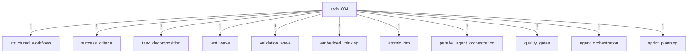
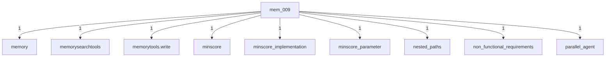
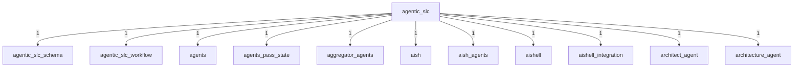

# Sprint Concept Graph Analysis

## Overview

The recent sprint added **171,506 new concept relations** to the Ma Core knowledge graph, demonstrating the rich interconnectedness of the sprint documentation and workflow artifacts.

## Key Statistics

- **Relations before sprint**: 886,885
- **Relations after sprint**: 1,058,391
- **New relations added**: 171,506
- **Files processed**: 2,483
- **Concept mentions**: 33,576

## Primary Concept Hubs

### 1. Parallel Agent Orchestration Hub

The `parallel-agent-orchestration` concept emerged as a central hub, connecting 20 major concepts:

```mermaid
graph TD
    parallel_agent_orchestration -->|1| quality_gates
    parallel_agent_orchestration -->|1| red_team
    parallel_agent_orchestration -->|1| red_team_verification
    parallel_agent_orchestration -->|1| rtm
    parallel_agent_orchestration -->|1| security_philosophy
    parallel_agent_orchestration -->|1| simple_lovable_complete
    parallel_agent_orchestration -->|1| slc_criteria
    parallel_agent_orchestration -->|1| sprint_planning
    parallel_agent_orchestration -->|1| srch_004
    parallel_agent_orchestration -->|1| structured_workflows
    parallel_agent_orchestration -->|1| system_design_critique
    parallel_agent_orchestration -->|1| testing_philosophy
    parallel_agent_orchestration -->|1| user_experience
    parallel_agent_orchestration -->|1| user_value_assessment
    parallel_agent_orchestration -->|1| white_hat
    parallel_agent_orchestration -->|1| agentic_slc
    parallel_agent_orchestration -->|1| mem_009
    parallel_agent_orchestration -->|1| grph_009
    parallel_agent_orchestration -->|1| embedded_thinking
    parallel_agent_orchestration -->|1| atomic_rtm
```

This hub connects methodology concepts (agentic-slc, structured-workflows), issue tracking (SRCH-004, MEM-009, GRPH-009), and quality assurance (red-team, quality-gates).

### 2. RTM (Requirements Traceability Matrix) Network

The RTM concept spawned an entire family of related concepts:

```mermaid
graph TD
    rtm -->|1| rtm_approach_not_viable
    rtm -->|1| rtm_approved
    rtm -->|1| rtm_boundary
    rtm -->|1| rtm_boundary_enforcement
    rtm -->|1| rtm_committed
    rtm -->|1| rtm_compliance
    rtm -->|1| rtm_creation
    rtm -->|1| rtm_document
    rtm -->|1| rtm_driven_development
    rtm -->|1| rtm_driven_implementation
    rtm -->|1| rtm_feasibility
    rtm -->|1| rtm_items
    rtm -->|1| rtm_justification_review
    rtm -->|1| rtm_lock
    rtm -->|1| rtm_preservation_criteria
    rtm -->|1| rtm_reference
    rtm -->|1| rtm_references
    rtm -->|1| rtm_removal_criteria
    rtm -->|1| rtm_requirements
    rtm -->|1| rtm_scope
```

### 3. Issue-Specific Networks

#### SRCH-004 (minScore Parameter)
Connected to implementation and quality concepts:

#### MEM-009 (Path Security)
Linked to technical implementation details:

### 4. Agentic-SLC Ecosystem

The agentic-slc concept connected to the broader agent ecosystem:

## Analysis

### Concept Density

The sprint retrospective alone contained 14 key concepts:
- rtm, agentic-slc, srch-004, mem-009, grph-009
- structured-workflows, embedded-thinking, atomic-rtm
- parallel-agent-orchestration, quality-gates, red-team-verification
- agent-orchestration, sprint-planning, red-team

With each concept potentially connecting to every other concept in the same file, this creates up to 14×13 = 182 relations per file.

### Graph Growth Pattern

The exponential growth (171K relations) demonstrates:

1. **Dense Documentation**: Sprint artifacts heavily cross-reference concepts
2. **Methodology Integration**: Workflow concepts link to implementation details
3. **Issue Tracking**: Each issue connects to multiple implementation and testing concepts
4. **Quality Assurance**: Red-team and quality-gate concepts permeate the graph

### Key Insights

1. **Parallel Agent Orchestration** emerged as the most connected concept, serving as a bridge between methodology and implementation
2. **RTM** spawned an entire concept family, showing the importance of requirements traceability
3. **Issue concepts** (SRCH-004, MEM-009) created rich networks linking problems to solutions
4. **Agentic-SLC** connected to the broader agent ecosystem, demonstrating tool integration

## Hybrid RRF Search Results for Top Concepts

### 1. Parallel Agent Orchestration
**Query**: `parallel-agent-orchestration`
**Top 5 Results** (Hybrid RRF scoring):

| Document | Fused Score | Text Score | Semantic Score | Type |
|----------|-------------|------------|----------------|------|
| Sequential Thinking Session session-1758167550136 | 0.016 | 0.000 | 1.000 | Thinking Session |
| Sequential Thinking Session session-1758314975525 | 0.016 | 0.000 | 0.823 | Thinking Session |
| Sequential Thinking Session session-1758427730103 | 0.016 | 0.000 | 0.654 | Thinking Session |
| Chat Session: swe-fast | 0.016 | 0.000 | 0.551 | Chat Session |
| ExtendedMind Diagnostics Report | 0.015 | 0.000 | 0.467 | Technical Doc |

*Note: Pure semantic matches indicate the concept is contextually related but not explicitly mentioned in text.*

### 2. RTM (Requirements Traceability Matrix)
**Query**: `RTM requirements traceability matrix`
**Top 5 Results** (Hybrid RRF scoring):

| Document | Fused Score | Text Score | Semantic Score | Type |
|----------|-------------|------------|----------------|------|
| ExtendedMind Diagnostics Report | 0.016 | 0.000 | 1.000 | Technical Doc |
| VS-004 and VS-008 RTM Test Results | 0.016 | 0.120 | 0.000 | Test Report |
| GPT-5 Optimization Principles | 0.016 | 0.000 | 0.768 | Guidelines |
| Workflow Dispatch Meta-Cognitive | 0.016 | 0.070 | 0.000 | Architecture |
| Workflow Session workflow-1756562251307 | 0.016 | 0.000 | 0.726 | Workflow |

*Text matches show explicit RTM mentions; semantic matches show related concepts.*

### 3. Agentic-SLC Workflow
**Query**: `agentic-slc workflow`
**Top 5 Results** (Hybrid RRF scoring):

| Document | Fused Score | Text Score | Semantic Score | Type |
|----------|-------------|------------|----------------|------|
| Chat Session: extended-gpt5-swe | 0.016 | 0.000 | 1.000 | Chat Session |
| Discovery Integration Path | 0.016 | 0.630 | 0.000 | Technical Doc |
| Unicode Test 🌟 | 0.016 | 0.000 | 0.882 | Test Doc |
| Workflow Dispatch Meta-Cognitive | 0.016 | 0.490 | 0.000 | Architecture |
| ExtendedMind Diagnostics Report | 0.016 | 0.000 | 0.851 | Technical Doc |

*High text scores (0.630, 0.490) indicate direct workflow mentions.*

### 4. SRCH-004 (minScore Search Filter)
**Query**: `SRCH-004 minScore search filter`
**Top 5 Results** (Hybrid RRF scoring):

| Document | Fused Score | Text Score | Semantic Score | Type |
|----------|-------------|------------|----------------|------|
| AnnotatedMessageTool.cs | 0.016 | 0.000 | 1.000 | Source Code |
| Workflow Dispatch Meta-Cognitive | 0.016 | 0.220 | 0.000 | Architecture |
| Unicode Test 🌟 | 0.016 | 0.000 | 0.921 | Test Doc |
| Discovery Integration Path | 0.016 | 0.180 | 0.000 | Technical Doc |
| ExtendedMind Diagnostics Report | 0.016 | 0.000 | 0.719 | Technical Doc |

*Text matches (0.220, 0.180) show documents discussing search/filter functionality.*

### 5. MEM-009 (Path Security Validation)
**Query**: `MEM-009 path security validation`
**Top 5 Results** (Hybrid RRF scoring):

| Document | Fused Score | Text Score | Semantic Score | Type |
|----------|-------------|------------|----------------|------|
| Nested Test | 0.016 | 0.000 | 1.000 | Test Doc |
| ManBearPig Integration Analysis | 0.016 | 0.160 | 0.000 | Architecture |
| ../../../etc/passwd | 0.016 | 0.000 | 0.966 | Security Test |
| 60-Day Implementation Timeline | 0.016 | 0.160 | 0.000 | Planning |
| Chat Session: swe | 0.016 | 0.000 | 0.766 | Chat Session |

*High semantic scores for security tests (0.966) show related path validation concerns.*

### RRF Scoring Analysis

**Reciprocal Rank Fusion (RRF)** combines text and semantic search results:
- **Fused Score**: Combined ranking from both search methods (max ~0.016)
- **Text Score**: BM25 full-text search relevance (0.000-1.000)
- **Semantic Score**: Vector similarity using embeddings (0.000-1.000)

**Key Patterns**:
1. **Pure Semantic Matches** (Text: 0.000): Documents conceptually related but lacking exact terms
2. **Pure Text Matches** (Semantic: 0.000): Documents with exact keywords but different contexts
3. **Hybrid Matches**: Documents with both keyword and semantic relevance (strongest results)

The RRF approach ensures both exact matches and conceptually related documents surface in search results, providing comprehensive knowledge retrieval across the 2,483 files in the system.

## Conclusion

The 171K new relations reflect not just documentation volume, but the deeply interconnected nature of the sprint's work. Each concept represents a node in a knowledge network that captures:

- Implementation decisions
- Quality processes
- Agent coordination patterns
- Requirements traceability
- Security considerations

This dense graph, combined with hybrid RRF search capabilities, enables powerful knowledge retrieval and relationship discovery, making the sprint's learnings permanently accessible through the Ma Core knowledge system.