# maenifold MCP Server

## Core Function
Cognitive enhancement through interconnected memory and perspective tools.

## Tool Categories

### Memory System
- **ReadMemory** / **WriteMemory**: Access crystallized thoughts
- **SearchMemories**: Find concepts via semantic/exact search
- **EditMemory** / **DeleteMemory** / **MoveMemory**: Evolve understanding
- **BuildContext**: Map knowledge connections

### Perspective Tools
- **Adopt**: Professional roles, thinking hats, cognitive perspectives

### Thinking Methodologies
- **Workflow**: Structured workflows (30+ methodologies)
- **SequentialThinking**: Iterative thought evolution

## Usage Pattern
Connect ideas using [[Entity Name]] format. Each reference builds searchable knowledge webs.

**Example:**
```
I'm analyzing [[Software Architecture Patterns]] and need to compare [[Microservices]] vs [[Monoliths]]. Let me search for previous thoughts on [[System Design Trade-offs]].
```

## Tool Relationships

```mermaid
graph TD
    subgraph OVERALL["maenifold Cognitive Stack"]
        subgraph AGENT["AI Agent"]
            LLM[🧠 LLM Agent]
        end

        subgraph PERSP["Perspectives"]
            A[🎭 Adopt]
        end

        subgraph THINK["Thinking"]
            ST[🌊 SequentialThinking]
            WF[📋 Workflow]
        end

        subgraph MEMORY["Memory System"]
            MEM[🗄️ Memory]
                GRPH[🕸️ Graph]
        end
    end
    

    A --> LLM
    LLM --> WF
    LLM --> ST
    WF -.-> ST
    ST --> MEM
    WF --> MEM
    MEM --> GRPH
    GRPH --> LLM
    MEM --> LLM
```


maenifold operates on knowledge accumulation principles - each memory enriches future searches and connections.