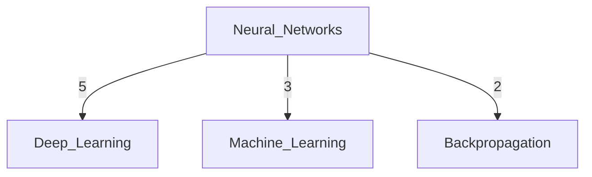

# Visualize

Generate Mermaid diagrams of concept relationships to visually explore your Maenifold knowledge graph. This tool transforms abstract concept connections into interactive visual diagrams, enabling pattern recognition and knowledge structure understanding through graph visualization of co-occurrence relationships extracted from your memory files.

## When to Use This Tool

- Creating visual maps of concept relationships for research and analysis presentations
- Understanding knowledge graph structure and concept clustering patterns in your memory system
- Generating diagrams for documentation, presentations, or external sharing of insights
- Discovering visual patterns and relationship densities around central concepts
- Creating interactive exploration aids for complex conceptual landscapes
- Building visual context for Sequential Thinking or Workflow sessions requiring diagram support
- Analyzing concept neighborhood connectivity and relationship strength visualization
- Generating research artifacts that demonstrate knowledge graph exploration results

## Key Features

- **Mermaid Diagram Generation**: Creates standard Mermaid graph syntax for rendering in compatible tools and platforms
- **Relationship Strength Visualization**: Shows co-occurrence counts as edge weights to indicate relationship strength
- **Configurable Node Limits**: Control diagram complexity by limiting maximum nodes for focused or comprehensive views
- **Depth-Aware Visualization**: Generates diagrams based on direct relationships from central concept with depth control
- **Automatic Node Sanitization**: Handles concept names with spaces and special characters for valid Mermaid syntax
- **Relationship Ranking**: Orders connections by co-occurrence frequency to highlight strongest concept relationships
- **Empty State Handling**: Gracefully handles concepts without connections or missing from knowledge graph
- **Interactive Output**: Generated Mermaid syntax renders as clickable, zoomable diagrams in supported environments

## Parameters

| Parameter | Type | Required | Description | Example |
|-----------|------|----------|-------------|---------|
| conceptName | string | Yes | Central concept for diagram generation (NOT a file!) | "Machine Learning" |
| depth | int | No | Graph depth for relationship inclusion (default: 2) | 1 |
| maxNodes | int | No | Maximum nodes to include in diagram (default: 30) | 50 |

## Usage Examples

### Basic Concept Visualization
```json
{
  "conceptName": "Neural Networks"
}
```
Generates Mermaid diagram showing Neural Networks relationships with default 2-depth exploration and 30 node limit.

### Focused Direct Relationships
```json
{
  "conceptName": "GraphRAG",
  "depth": 1,
  "maxNodes": 15
}
```
Creates focused diagram showing only immediate (1-hop) GraphRAG relationships, limited to 15 most connected concepts.

### Comprehensive Knowledge Map
```json
{
  "conceptName": "Transformer Architecture",
  "depth": 2,
  "maxNodes": 50
}
```
Generates comprehensive diagram with 2-hop relationship exploration, including up to 50 nodes for broad conceptual coverage.

### Minimal Relationship Overview
```json
{
  "conceptName": "Attention Mechanism",
  "depth": 1,
  "maxNodes": 10
}
```
Creates simple diagram showing only direct Attention Mechanism relationships, limited to 10 strongest connections for clarity.

## Common Patterns

### Research Presentation Diagrams
Generate visual aids for research presentations showing conceptual relationships and knowledge structure around key topics.

### Knowledge Gap Visualization
Create diagrams to identify sparsely connected concepts or missing relationships in your knowledge graph structure.

### Concept Clustering Analysis  
Visualize how concepts naturally cluster through relationship density, revealing knowledge organization patterns in your memory system.

### Interactive Exploration Aids
Generate diagrams as starting points for interactive knowledge exploration, using visual connections to guide deeper investigation.

### Documentation Enhancement
Create visual supplements for written analysis, showing relationship structures that support textual explanations and insights.

### Workflow Context Visualization
Generate concept relationship diagrams before structured thinking sessions to provide visual context for systematic exploration.

## Related Tools

- **Sync**: Essential prerequisite - must run Sync to extract concept relationships from memory files before visualization
- **BuildContext**: Complementary tool that provides textual relationship exploration while Visualize shows visual patterns  
- **SearchMemories**: Use after Visualize to access specific memory files containing visualized concept relationships
- **SequentialThinking**: Include Visualize-generated diagrams as context for thinking sessions requiring visual relationship understanding
- **WriteMemory**: Create new memory files documenting insights discovered through visual relationship exploration
- **ReadMemory**: Access specific memory files that contain the concept relationships shown in generated diagrams

## Mermaid Diagram Types

### Standard Relationship Diagrams
Default output format showing concepts as nodes with weighted edges representing co-occurrence strength:


### Single Concept Isolation
When concept exists but has no relationships, shows isolated node with explanatory message:
```mermaid
graph TD
    Isolated_Concept [No connections found]
```

### High-Density Relationship Maps
For concepts with many connections, diagram shows strongest relationships first up to maxNodes limit, creating manageable visualizations.

## Visualization Strategies

### Focused Analysis (5-15 nodes)
Use smaller node limits to create clear, focused diagrams highlighting core concept relationships without visual complexity.

### Comprehensive Mapping (30-50 nodes)  
Generate broader diagrams for complete conceptual landscape visualization, showing extensive relationship networks and patterns.

### Depth Control Strategies
- **Depth 1**: Direct relationships only, clear causal or definitional connections
- **Depth 2**: Extended neighborhood including concept-of-concept relationships for broader context

### Relationship Strength Interpretation
Edge weights (co-occurrence counts) indicate:
- **High weights (5+)**: Core conceptual relationships, frequently co-occurring topics
- **Medium weights (2-4)**: Related concepts, occasional co-occurrence in memory files  
- **Low weights (1)**: Peripheral relationships, single-file co-occurrence patterns

## Integration with Knowledge Research

### Visual-First Exploration
Start research with Visualize to understand conceptual landscape, then use BuildContext for detailed relationship analysis.

### Diagram-Supported Thinking
Include visualization output in Sequential Thinking sessions as visual reference for relationship-aware analysis.

### Multi-Modal Knowledge Discovery  
Combine visual diagrams with textual search and context building for comprehensive knowledge exploration strategies.

### Research Documentation
Generate diagrams as research artifacts demonstrating knowledge graph exploration and conceptual relationship discovery.

## Troubleshooting

### Error: "CONCEPT 'X' not found"
**Cause**: Concept doesn't exist in knowledge graph or requires different spelling/capitalization  
**Solution**: Run Sync to update graph from recent memory files, verify concept exists with SearchMemories, or check exact spelling

### Error: "Run sync first"
**Cause**: Knowledge graph database is empty or outdated relative to memory files  
**Solution**: Execute Sync tool to extract [[concepts]] from memory files and build/update relationship graph

### Empty diagram with "No connections found"
**Cause**: Concept exists in isolation without co-occurring with other [[concepts]] in memory files  
**Solution**: Create memory files that mention this concept alongside related [[concepts]] to establish graph connections

### Diagram too complex with maxNodes limit
**Cause**: Central concept has many relationships creating visually overwhelming diagrams  
**Solution**: Reduce maxNodes parameter (try 15-20) or use depth=1 for simpler relationship visualization

### Mermaid syntax rendering issues  
**Cause**: Concept names with special characters or formatting incompatible with Mermaid syntax  
**Solution**: Tool automatically sanitizes names, but complex Unicode or symbols may require concept renaming

### Missing expected concept relationships
**Cause**: Related concepts exist in separate memory files without co-occurrence patterns  
**Solution**: Create bridging memory files mentioning related [[concepts]] together to establish visual connections

### Performance issues with large diagrams
**Cause**: High maxNodes values with dense concept graphs create complex diagrams  
**Solution**: Start with smaller limits (10-20 nodes) and increase gradually to find optimal visualization complexity

## Mermaid Rendering Environments

### Compatible Platforms
Generated Mermaid syntax renders in:
- **GitHub/GitLab**: Automatic rendering in markdown files and README documentation
- **Obsidian**: Native Mermaid plugin support for interactive diagram exploration  
- **VS Code**: Mermaid preview extensions for diagram development and editing
- **Notion**: Mermaid block support for knowledge base documentation
- **Web Browsers**: Mermaid.js library for interactive diagram embedding

### Export and Sharing
Use generated Mermaid syntax to:
- Copy into documentation platforms supporting Mermaid rendering
- Save as `.md` files with Mermaid code blocks for version control
- Convert to static images using Mermaid CLI or online converters
- Embed in presentations or reports requiring visual relationship demonstration

## Advanced Visualization Patterns

### Concept Neighborhood Mapping
Generate multiple diagrams around related concepts to build comprehensive visual knowledge maps showing interconnected conceptual territories.

### Relationship Strength Analysis
Compare multiple concept visualizations to identify relationship patterns and knowledge graph density variations across different domains.

### Knowledge Evolution Tracking
Create periodic visualizations of key concepts to track how relationships evolve as memory files and knowledge grow over time.

### Cross-Domain Bridge Discovery
Visualize concepts that appear in multiple domains to identify knowledge bridges and interdisciplinary connection patterns.

## Ma Protocol Compliance

Visualize follows Maenifold's Ma Protocol principles:
- **Simplicity**: Single responsibility for Mermaid diagram generation from concept relationships
- **No Magic**: Direct SQLite query to concept_graph table with transparent relationship retrieval  
- **Static Implementation**: Pure function approach with no state management or complex object hierarchies
- **Real Infrastructure**: Uses actual database relationships, not simulated or mocked graph data
- **Performance Focused**: Efficient queries with limits and ranking to generate diagrams quickly
- **250-Line Limit**: Concise implementation focused on essential diagram generation functionality

This tool transforms your memory files' concept relationships into visual knowledge maps, revealing the hidden structure and connection patterns in your accumulated knowledge through interactive Mermaid diagram generation.