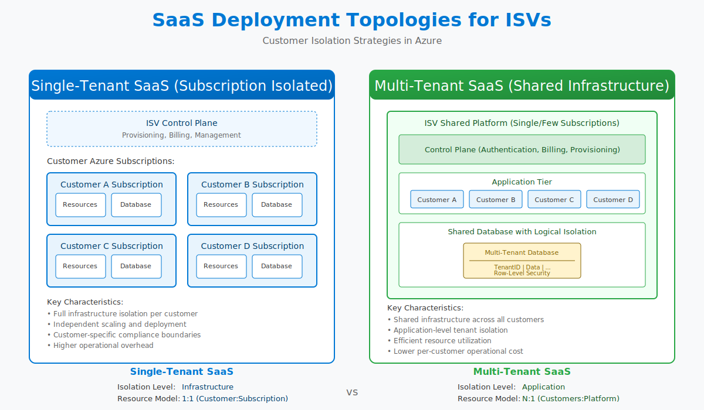

# Customer isolation

ISVs commonly operate on two primary delivery models highlighted in [Microsoft's landing zone guidance](https://learn.microsoft.com/en-us/azure/cloud-adoption-framework/ready/landing-zone/isv-landing-zone). The [ISV landing zone documentation](https://learn.microsoft.com/en-us/azure/cloud-adoption-framework/ready/landing-zone/isv-landing-zone) describes pure SaaS, customer-deployed, and dual-deployment SaaS models and how they relate to Azure landing zones. This folder focuses on pure SaaS scenarios where the ISV controls subscriptions and isolates customers through dedicated or shared deployment stamps.

- Dedicated (single-tenant) environments where each customer receives an isolated subscription and landing zone.
- Shared (multi-tenant) SaaS platforms that centralize control planes while segmenting tenant workloads through application logic and deployment stamps.

The [ISV landing zone guidance](https://learn.microsoft.com/en-us/azure/cloud-adoption-framework/ready/landing-zone/isv-landing-zone) identifies three common deployment models—pure SaaS, customer-deployed, and dual-deployment SaaS—each with different landing zone implications. The guides in this directory show how those models map to Azure subscription and landing zone design so you can adopt the pattern that fits your product roadmap.

Use this directory to choose the isolation model that aligns with your product offering:

- [Single-tenant deployment guide](single-tenant/README.md)—guidance for customer-isolated deployments, including subscription vending, landing zone setup, and availability zone alignment.
- [Multi-tenant deployment guide](multi-tenant/README.md)—guidance for centrally operated SaaS solutions that rely on shared infrastructure, deployment stamps, and multitenant governance.

Before diving into either model, review the [Azure landing zone guidance tailored for ISVs](https://learn.microsoft.com/en-us/azure/cloud-adoption-framework/ready/landing-zone/isv-landing-zone). It shows how to structure management groups, subscriptions, and shared services to support both deployment approaches.
