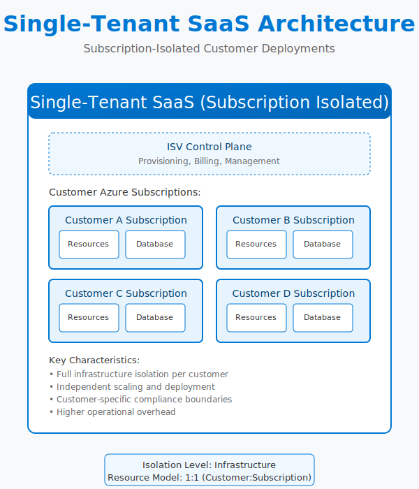
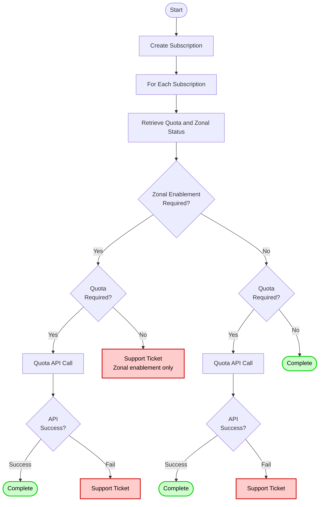

# Single-tenant deployment guide

Use this guide when each customer gets a dedicated Azure subscription or deployment stamp. The [ISV landing zone guidance](https://learn.microsoft.com/en-us/azure/cloud-adoption-framework/ready/landing-zone/isv-landing-zone) defines this "customer-deployed" model as one of the core ISV patterns—customers run workloads inside subscriptions that you provision or manage on their behalf. This approach maximizes isolation, aligns with per-customer regulatory requirements, and simplifies noisy-neighbor mitigation at the expense of higher infrastructure cost per tenant using the [deployment stamps pattern](https://learn.microsoft.com/en-us/azure/architecture/guide/multitenant/approaches/overview#deployment-stamps-pattern).

## Subscription quota flow without quota groups

When each subscription manages its own quota independently, the subscription vending workflow introduces several failure points that can block or delay customer onboarding. Azure's Quota API handles most regional VM quota increases programmatically, but specific scenarios require manual support ticket escalation.

> [!WARNING]
> **Quota API rejection.** The [Quota API](https://learn.microsoft.com/en-us/azure/quotas/per-vm-quota-requests) rejects increase requests when regional capacity is constrained, rate limits are exceeded, or the SKU is restricted by subscription offer type. API rejections return error codes but don't provide capacity availability timelines—operators can't distinguish between temporary capacity shortages and permanent regional restrictions without opening a support ticket.

> [!WARNING]
> **Zonal enablement isn't self-service.** GPU VM families and other restricted SKUs require [zonal enablement requests](https://learn.microsoft.com/en-us/troubleshoot/azure/general/zonal-enablement-request-for-restricted-vm-series) through Azure Support before the Quota API will accept increases. This means subscriptions that need both zonal enablement and quota increases require at least one manual support ticket per subscription-SKU combination, even if the subscription only needs a single VM.

> [!WARNING]
> **N×M ticket explosion.** When vending multiple subscriptions (N) that each require multiple restricted SKUs (M), the foreach loop over subscriptions generates N×M support tickets. If 10 customers each need 3 GPU SKUs across 2 regions, that's 60 individual tickets—each requiring manual review and approval before deployment can proceed.

> [!WARNING]
> **Timing gaps.** Quota API requests complete in minutes to hours when capacity is available. Support tickets for zonal enablement or [region access](https://learn.microsoft.com/en-us/troubleshoot/azure/general/region-access-request-process) take 3-10 business days on average, and responses don't guarantee capacity—they only confirm eligibility. This timing variance makes it difficult to commit to onboarding SLAs when you can't predict which subscriptions will hit the manual path.
>
> *These timelines reflect Microsoft CSU operational experience, not documented Azure SLAs.*

> [!IMPORTANT]
> **Quota doesn't guarantee capacity.** Approved quota increases establish the subscription's entitlement ceiling but don't reserve physical capacity. ARM deployments can still fail with `SkuNotAvailable` errors when regional capacity is exhausted, even if the subscription has sufficient quota headroom. This gap between quota approval and deployment success means testing the full onboarding flow in production is the only way to validate capacity availability.

## Landing zone preparation

1. **Design the control plane.** Follow the [ISV landing zone guidance](https://learn.microsoft.com/en-us/azure/cloud-adoption-framework/ready/landing-zone/isv-landing-zone) to organize management groups, policies, and shared services before onboarding customer subscriptions. Separate corporate IT assets from the SaaS product landing zone if your organization uses different operating models.
2. **Define subscription vending workflows.** Automate subscription creation (EA or MCA) and attach the new subscription to the correct management group, policy assignments, and billing profile. Capture owner/contributor assignments during provisioning so operations teams can [manage the environment end to end](https://learn.microsoft.com/en-us/azure/cloud-adoption-framework/ready/landing-zone/isv-landing-zone).
3. **Apply baseline policies.** Enforce guardrails for networking, identity, tagging, cost management, and diagnostics so every customer environment starts [compliant with corporate standards](https://learn.microsoft.com/en-us/azure/cloud-adoption-framework/ready/landing-zone/isv-landing-zone).

## Deployment stamps

- **Stamp per customer.** Deploy a repeatable infrastructure footprint (virtual network, hub services, shared monitoring) per customer. [Single-tenant stamps](https://learn.microsoft.com/en-us/azure/architecture/guide/multitenant/approaches/overview#deployment-stamps-pattern) provide clear isolation boundaries and avoid the need for multitenant logic inside the workload.
- **Automate stamp rollout.** Use infrastructure as code (Bicep, Terraform, ARM) or SDK automation to instantiate the stamp whenever a new customer onboards. Maintain versioning so [upgrades can be rolled out safely](https://learn.microsoft.com/en-us/azure/architecture/guide/multitenant/approaches/overview#deployment-stamps-pattern) across the stamp fleet.
- **Support dual-deployment scenarios.** Some ISVs offer both dedicated and shared deployment options. Document how the single-tenant stamp integrates with any central control plane so you can [reuse automation and monitoring patterns](https://learn.microsoft.com/en-us/azure/cloud-adoption-framework/ready/landing-zone/isv-landing-zone) across models.
- **Plan for regional variation.** Some customers require specific geographies or availability zones. Incorporate availability zone alignment and [regional access requests](https://learn.microsoft.com/en-us/troubleshoot/azure/general/region-access-request-process) into the onboarding checklist to prevent last-minute deployment blocks.

## Workload configuration

- **Compute isolation.** Choose SKUs and scaling rules that reflect customer contract expectations. Single-tenant models justify higher per-customer spend, so [align pricing with the required compute footprint and SLAs](https://learn.microsoft.com/en-us/azure/well-architected/saas/compute#tenancy-model-and-isolation).
- **Data isolation.** Provision dedicated data stores (for example, separate Azure SQL databases or Cosmos DB accounts) per customer. This simplifies compliance audits and supports [customer-specific backup/restore operations](https://learn.microsoft.com/en-us/azure/well-architected/saas/data).

## Cost allocation surfaces

Azure exposes these surfaces for per-tenant cost tracking in single-tenant deployments:

- **Tag inheritance:** [Tag inheritance policies](https://learn.microsoft.com/en-us/azure/cost-management-billing/costs/enable-tag-inheritance) apply subscription and resource group tags to cost records, allowing filtering by customer or business unit without modifying resources.
- **Cost data ingestion:** [FinOps Hubs](https://learn.microsoft.com/en-us/cloud-computing/finops/toolkit/hubs/finops-hubs-overview) aggregates cost data from tenant subscriptions into Azure Data Explorer for analysis across the stamp fleet.
- **Cost exports:** [Scheduled exports](https://learn.microsoft.com/en-us/azure/cost-management-billing/costs/tutorial-export-acm-data) deliver cost data to storage accounts for integration with internal systems.

## Lifecycle management

- **Onboarding:** Automate the sequence—create subscription, apply the landing zone blueprint, deploy the stamp, run validation tests, and hand over to customer success so teams aren't rebuilding steps manually.
- **Expansion:** When customers need more capacity, scale the stamp vertically or horizontally, or [deploy additional stamps](https://learn.microsoft.com/en-us/azure/architecture/guide/multitenant/approaches/overview#deployment-stamps-pattern) for regional redundancy. Coordinate with quota and reservation guides to guarantee capacity.
- **Recycle vs. retire:** When a customer churns, reclaim quotas and shared services but keep the subscription if [region/zone enablement or regulatory approvals](https://learn.microsoft.com/en-us/troubleshoot/azure/general/region-access-request-process) might be reused for future tenants.

