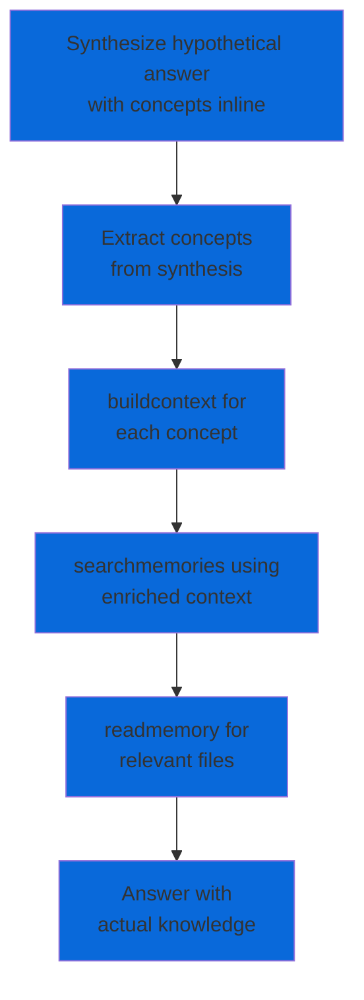
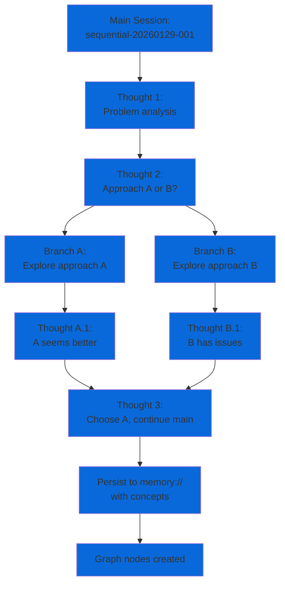
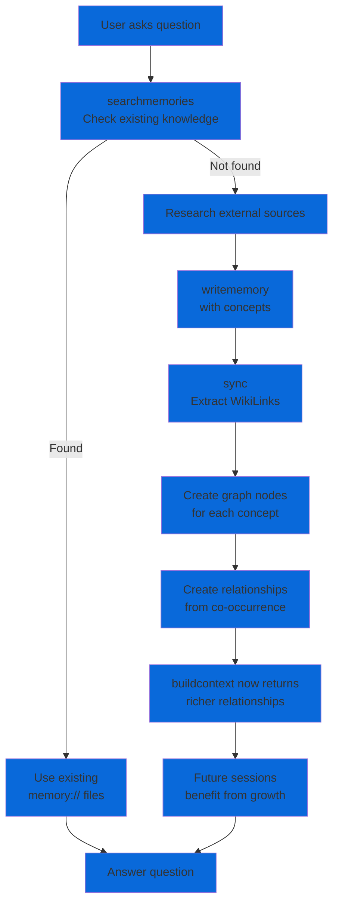
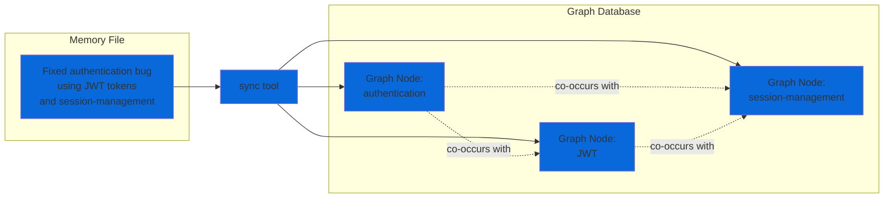
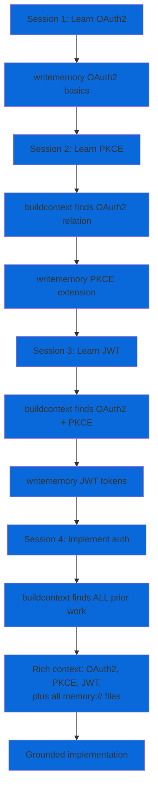

# Maenifold Skill for Claude Code

<!-- NOTE: Installation content is duplicated in skills/maenifold/references/README.md (canonical for AI agents). Keep both in sync. -->

This skill provides Claude Code with access to maenifold's knowledge graph and reasoning infrastructure. It enables persistent memory, graph-based context building, structured workflows, and multi-session thinking continuity.

## Overview

The maenifold skill exposes 25+ MCP tools that transform ephemeral AI sessions into continuous collective intelligence:

- **Memory Tools**: Write, read, search, edit, and organize knowledge files with `[[WikiLink]]` graph integration
- **Graph Tools**: Build context, find similar concepts, visualize relationships, and sync the knowledge graph
- **Reasoning Tools**: Sequential thinking with branching, structured workflows, and assumption tracking
- **System Tools**: Adopt roles/perspectives, monitor activity, and manage configuration

Every `[[WikiLink]]` you create becomes a node in the graph. Knowledge compounds across sessions instead of resetting.

## Cognitive Architecture

Maenifold operates as a **6-layer composition architecture** where higher layers invoke lower layers. Complexity emerges from composition, not bloated tools.

### 6-Layer Stack


**Layer 1: Concepts** - Every `[[WikiLink]]` becomes a graph node. Foundation for all knowledge.

**Layer 2: Memory + Graph** - Tools persist (`writememory`) and query (`searchmemories`, `buildcontext`, `findsimilarconcepts`) knowledge.

**Layer 3: Session** - Track state across interactions (`recentactivity`, `assumptionledger`).

**Layer 4: Persona** - Condition reasoning through roles/colors/perspectives (`adopt`).

**Layer 5: Reasoning** - Enable revision, branching, multi-day persistence (`sequentialthinking`).

**Layer 6: Orchestration** - Compose all layers; workflows can nest workflows (`workflow`).

### Tool Composition Patterns

#### Chain Pattern


**Use case**: Navigate from unknown domain to specific knowledge.

**Example**:
1. `findsimilarconcepts("authentication")` → finds [[auth]], [[authentication]], [[JWT]]
2. Pick [[authentication]] as best match
3. `buildcontext("authentication", depth=2)` → related concepts + files
4. `searchmemories("JWT authentication patterns")` → relevant memory files
5. `readmemory("memory://security/jwt-implementation")` → specific content

#### HYDE Pattern (Hypothetical Document Embeddings)



**Use case**: Answer complex questions by first hypothesizing, then grounding in graph.

**Example**:
```
User: "How do I implement OAuth2 flows?"

1. Synthesize: "OAuth2 requires [[authorization-server]], [[client-credentials]],
   [[token-endpoint]], and [[JWT]] validation..."

2. Extract: [[authorization-server]], [[client-credentials]], [[token-endpoint]], [[JWT]]

3. buildcontext for each concept (parallel)

4. searchmemories with enriched understanding

5. readmemory for implementation guides

6. Answer grounded in actual memory:// files
```

#### Sequential Thinking Branching



**Use case**: Explore multiple alternatives without losing thought continuity.

**Example**:
```
1. Start session (thought 0): Set up problem
2. Thought 1: Identify two potential solutions
3. Branch A: Explore solution 1 (thoughts A.1, A.2, A.3)
4. Branch B: Explore solution 2 (thoughts B.1, B.2, B.3)
5. Thought 2 (main): Compare branches, choose best
6. Continue main session with chosen approach
```

### Knowledge Graph Growth



**Key insight**: The graph is not static. Every interaction can grow it:

1. **Question**: User asks about [[authentication]]
2. **Search**: `searchmemories("authentication")` finds gap
3. **Research**: Query external docs (Microsoft Docs, Context7)
4. **Write**: `writememory` creates lineage-backed note with [[OAuth2]], [[JWT]], [[PKCE]]
5. **Sync**: Extracts all `[[WikiLinks]]` like [[OAuth2]], [[JWT]], [[PKCE]] and creates graph nodes
6. **Growth**: `buildcontext("authentication")` now returns OAuth2, JWT, PKCE relationships
7. **Future**: Next session asking about [[OAuth2]] benefits from prior work

**Compounding effect**: Graph becomes institutional memory that persists and improves across all sessions.

### How Concepts Become Nodes



**Process**:
1. Write memory file with `[[WikiLinks]]` in double brackets (e.g., [[authentication]], [[JWT]])
2. Call `sync` (or happens automatically)
3. Sync extracts all `[[WikiLinks]]` from all memory files
4. Creates/updates graph nodes for each unique concept
5. Records co-occurrence relationships (concepts in same file = related)
6. Future `buildcontext` queries traverse these relationships

**Best practices**:
- Use `[[singular-form]]` for general concepts
- Use `[[hyphens-not-spaces]]` for multi-word concepts
- Tag substance, not structure (avoid `[[the]]`, `[[a]]`, `[[file]]`)
- Reuse existing concepts before creating near-duplicates

### Context Compounding Example



**Timeline**:
- **Day 1**: Learn OAuth2 basics → write memory:// note with [[OAuth2]]
- **Day 2**: Learn PKCE → buildcontext finds [[OAuth2]] relation → write note with [[PKCE]]
- **Day 3**: Learn JWT → buildcontext finds [[OAuth2]] + [[PKCE]] → write note with [[JWT]]
- **Day 4**: Implement auth → buildcontext returns **all 3 concepts + all notes** → rich implementation context

**Result**: Knowledge compounds over time. Later sessions benefit from all prior work automatically.

## Prerequisites

- **Claude Code** (CLI or VS Code extension)
- **maenifold binary** installed and accessible in PATH (or specify full path in configuration)
- **Write permissions** to the maenifold data directory (default: `~/maenifold`)

## Installation

### Method 1: Plugin Installation (Recommended)

Install the maenifold plugin directly through Claude Code:

```bash
claude plugin install msbrettorg/maenifold
```

This automatically:
- Downloads the maenifold plugin
- Configures MCP server settings
- Registers the skill for automatic invocation

### Method 2: Manual Installation

If you prefer manual setup or need custom configuration:

1. Clone or download the plugin files to your `.claude/plugins` directory
2. Configure the MCP server in your project's `.mcp.json` (see MCP Configuration below)
3. Copy skill files to your project or reference them from the plugin cache

## Binary Installation

The maenifold MCP server requires the maenifold binary. Choose your installation method:

### GitHub Releases (Recommended)

Download the latest release for your platform from [GitHub Releases](https://github.com/msbrettorg/maenifold/releases/latest).

#### macOS

1. Download the appropriate archive:
   - **Apple Silicon (M1/M2/M3)**: `maenifold-osx-arm64.tar.gz`
   - **Intel**: `maenifold-osx-x64.tar.gz`

2. Extract to `~/maenifold/bin`:
   ```bash
   # Download (replace URL with correct architecture)
   curl -L -o maenifold.tar.gz https://github.com/msbrettorg/maenifold/releases/latest/download/maenifold-osx-arm64.tar.gz

   # Extract to bin directory
   mkdir -p ~/maenifold/bin
   tar -xzf maenifold.tar.gz -C ~/maenifold/bin --strip-components=1
   ```

3. Add to PATH:
   ```bash
   # Add to ~/.zshrc or ~/.bash_profile
   echo 'export PATH="$HOME/maenifold/bin:$PATH"' >> ~/.zshrc

   # Reload shell configuration
   source ~/.zshrc
   ```

4. Verify installation:
   ```bash
   maenifold --tool GetConfig --payload '{}'
   ```

#### Linux

1. Download `maenifold-linux-x64.tar.gz`

2. Extract to `~/maenifold/bin`:
   ```bash
   # Download
   curl -L -o maenifold.tar.gz https://github.com/msbrettorg/maenifold/releases/latest/download/maenifold-linux-x64.tar.gz

   # Extract to bin directory
   mkdir -p ~/maenifold/bin
   tar -xzf maenifold.tar.gz -C ~/maenifold/bin --strip-components=1
   ```

3. Add to PATH:
   ```bash
   # Add to ~/.bashrc or ~/.zshrc
   echo 'export PATH="$HOME/maenifold/bin:$PATH"' >> ~/.bashrc

   # Reload shell configuration
   source ~/.bashrc
   ```

4. Verify installation:
   ```bash
   maenifold --tool GetConfig --payload '{}'
   ```

#### Windows

1. Download `maenifold-win-x64.zip`

2. Extract to `%USERPROFILE%\maenifold\bin`:
   ```powershell
   # Download (adjust path to your Downloads folder)
   $downloadPath = "$env:USERPROFILE\Downloads\maenifold-win-x64.zip"

   # Create directory and extract
   New-Item -ItemType Directory -Force -Path "$env:USERPROFILE\maenifold\bin"
   Expand-Archive -Path $downloadPath -DestinationPath "$env:USERPROFILE\maenifold\bin" -Force
   ```

3. Add to PATH:
   ```powershell
   # Add to user PATH
   $path = [Environment]::GetEnvironmentVariable("PATH", "User")
   $newPath = "$env:USERPROFILE\maenifold\bin"
   if ($path -notlike "*$newPath*") {
       [Environment]::SetEnvironmentVariable("PATH", "$path;$newPath", "User")
   }

   # Restart terminal for PATH change to take effect
   ```

4. Verify installation:
   ```powershell
   maenifold --tool GetConfig --payload '{}'
   ```

### Homebrew (Alternative for macOS/Linux)

If you prefer using Homebrew package manager:

```bash
brew install msbrettorg/tap/maenifold
```

This installs the binary and adds it to your PATH automatically. Note that the default installation location differs from the recommended `~/maenifold` directory.

### Build from Source

Requires .NET 9.0 SDK.

```bash
git clone https://github.com/msbrettorg/maenifold.git
cd maenifold
dotnet build -c Release
```

The binary will be at `src/Maenifold/bin/Release/net9.0/maenifold` (or `maenifold.exe` on Windows). Copy to `~/maenifold/bin` and add to PATH as shown in the platform-specific instructions above:

```bash
# macOS/Linux
mkdir -p ~/maenifold/bin
cp src/Maenifold/bin/Release/net9.0/maenifold ~/maenifold/bin/
```

## MCP Configuration

The maenifold skill requires the MCP server to be configured. Configuration varies by client.

### Claude Code

Create or update `.mcp.json` in your project root:

```json
{
  "mcpServers": {
    "maenifold": {
      "command": "maenifold",
      "args": ["--mcp"],
      "type": "stdio"
    }
  }
}
```

If maenifold is not in PATH, specify the full path to your installation:

**macOS/Linux**:
```json
{
  "mcpServers": {
    "maenifold": {
      "command": "/Users/<username>/maenifold/bin/maenifold",
      "args": ["--mcp"],
      "type": "stdio"
    }
  }
}
```

**Windows**:
```json
{
  "mcpServers": {
    "maenifold": {
      "command": "C:\\Users\\<username>\\maenifold\\bin\\maenifold.exe",
      "args": ["--mcp"],
      "type": "stdio"
    }
  }
}
```

### Claude Desktop

Edit the configuration file at:
- **macOS**: `~/Library/Application Support/Claude/claude_desktop_config.json`
- **Windows**: `%APPDATA%\Claude\claude_desktop_config.json`

Add the maenifold server:

```json
{
  "mcpServers": {
    "maenifold": {
      "command": "maenifold",
      "args": ["--mcp"]
    }
  }
}
```

If maenifold is not added to PATH, use the full path:

**macOS/Linux**:
```json
{
  "mcpServers": {
    "maenifold": {
      "command": "/Users/<username>/maenifold/bin/maenifold",
      "args": ["--mcp"]
    }
  }
}
```

**Windows**:
```json
{
  "mcpServers": {
    "maenifold": {
      "command": "C:\\Users\\<username>\\maenifold\\bin\\maenifold.exe",
      "args": ["--mcp"]
    }
  }
}
```

Replace `<username>` with your actual username, or use environment variable expansion if your client supports it.

### Codex CLI

Edit `~/.codex/config.toml`:

```toml
[mcp_servers.maenifold]
type = "stdio"
command = "maenifold"
args = ["--mcp"]
startup_timeout_sec = 120
tool_timeout_sec = 600
```

With custom data directory:

```toml
[mcp_servers.maenifold]
type = "stdio"
command = "maenifold"
args = ["--mcp"]
startup_timeout_sec = 120
tool_timeout_sec = 600
env = { MAENIFOLD_ROOT = "~/my-knowledge-base" }
```

## Environment Variables

| Variable | Description | Default |
|----------|-------------|---------|
| `MAENIFOLD_ROOT` | Root directory for memory files and database | `~/maenifold` |

Set the environment variable to use a custom location:

```bash
# Bash/Zsh
export MAENIFOLD_ROOT=~/my-knowledge-base

# PowerShell
$env:MAENIFOLD_ROOT = "$HOME\my-knowledge-base"
```

Or specify it in the MCP configuration:

```json
{
  "mcpServers": {
    "maenifold": {
      "command": "maenifold",
      "args": ["--mcp"],
      "type": "stdio",
      "env": {
        "MAENIFOLD_ROOT": "~/my-knowledge-base"
      }
    }
  }
}
```

## Verification

After installation, verify the setup:

### 1. Check Binary Installation

```bash
maenifold --tool GetConfig --payload '{}'
```

Expected output: JSON configuration including `maenifoldRoot` path and version info

### 2. Test MCP Server

```bash
maenifold --mcp
```

The server should start and wait for JSON-RPC input. Press Ctrl+C to exit.

### 3. Test from Claude Code

Start Claude Code and try:

```
Write a test memory about [[installation]] verification
```

If successful, you should see confirmation that the memory was written.

### 4. Verify Skill Loading

In Claude Code, the skill should load automatically when you mention:
- "write memory", "read memory", "search memories"
- "build context", "find similar concepts"
- "sequential thinking", "run workflow"
- `[[WikiLinks]]`, `memory://`, or maenifold tools

## Troubleshooting

### "Command not found" Error

- **Cause**: maenifold binary not in PATH
- **Solution**: Either add the installation directory to PATH or use the full path in MCP configuration

### "Permission denied" Error

- **Cause**: Cannot write to MAENIFOLD_ROOT directory
- **Solution**: Ensure the directory exists and you have write permissions:
  ```bash
  mkdir -p ~/maenifold
  chmod 755 ~/maenifold
  ```

### MCP Server Timeout

- **Cause**: Server taking too long to start
- **Solution**: Increase timeout in configuration:
  ```json
  {
    "mcpServers": {
      "maenifold": {
        "command": "maenifold",
        "args": ["--mcp"],
        "type": "stdio",
        "timeout": 120000
      }
    }
  }
  ```

### Database Lock Error

- **Cause**: Multiple processes accessing the same database
- **Solution**: Ensure only one MCP server instance is running per MAENIFOLD_ROOT. The system supports concurrent agents, but each must use the same server instance.

### Skill Not Loading

- **Cause**: Skill files not found or plugin not installed
- **Solution**:
  1. Run `claude plugin list` to verify installation
  2. Reinstall with `claude plugin install msbrettorg/maenifold`

### Empty Search Results

- **Cause**: Graph not synced after adding memories
- **Solution**: Run the sync tool:
  ```
  Sync the knowledge graph
  ```

## Client Comparison

| Feature | Claude Code | Claude Desktop | Codex CLI |
|---------|-------------|----------------|-----------|
| Config Format | JSON (`.mcp.json`) | JSON | TOML |
| Config Location | Project root | App Support folder | `~/.codex/` |
| Skill Support | Yes | No | Partial |
| Plugin Install | `claude plugin install` | Manual only | Manual only |
| Env Variables | In config or shell | In config | In config |
| Timeout Config | `timeout` field | Not configurable | `startup_timeout_sec`, `tool_timeout_sec` |

## Related Documentation

- [Main README](https://github.com/msbrettorg/maenifold/blob/main/README.md) - Project overview and quick start
- [Full Documentation](https://github.com/msbrettorg/maenifold/blob/main/docs/README.md) - Architecture and examples
- [GitHub Releases](https://github.com/msbrettorg/maenifold/releases) - Download binaries
- [SKILL.md](./skills/maenifold/SKILL.md) - Skill usage and tool reference

## Tool Reference

For detailed tool documentation, see the [skills/maenifold/usage/](./skills/maenifold/usage/) directory:

| Category | Tools |
|----------|-------|
| Memory | `writememory`, `readmemory`, `searchmemories`, `editmemory`, `deletememory`, `movememory`, `listmemories` |
| Graph | `buildcontext`, `findsimilarconcepts`, `visualize`, `sync`, `extractconceptsfromfile` |
| Repair | `analyzeconceptcorruption`, `repairconcepts` |
| Reasoning | `workflow`, `sequentialthinking`, `assumptionledger` |
| System | `adopt`, `getconfig`, `gethelp`, `listassets`, `memorystatus`, `readmcpresource`, `recentactivity`, `updateassets` |
