# Security Model

maenifold is a local-only, single-user context engineering infrastructure built in C# / .NET 9.0. It exposes two interfaces: an MCP server over stdio and a CLI. There is no network listener, no authentication, and no multi-user access control. The trust boundary is the OS user account.

This document describes what the security model **is**, not what it should be.

## Data Flow Diagram

```mermaid
flowchart TB
    classDef external fill:#4a6fa5,stroke:#2d4a7a,color:#fff
    classDef process fill:#6b8f71,stroke:#4a6b4f,color:#fff
    classDef datastore fill:#c9a227,stroke:#9a7d1e,color:#000
    classDef boundary fill:none,stroke:#888,stroke-width:2px,stroke-dasharray:8 4

    %% ── External Entities ──────────────────────────────────
    subgraph dist ["Distribution Channel"]
        direction LR
        NPM["npm Registry"]:::external
        BREW["Homebrew / GitHub Releases"]:::external
    end

    subgraph env ["User Environment"]
        direction LR
        MCPC["MCP Client\n(Claude Code, Desktop, etc.)"]:::external
        CLIU["CLI User\n(shell)"]:::external
        ENVV["Environment Variables\n(MAENIFOLD_ROOT, DATABASE_PATH)"]:::external
    end

    %% ── maenifold Process ──────────────────────────────────
    subgraph proc ["maenifold Process"]
        direction TB

        MCPS["MCP Server\n(stdio JSON-RPC)"]:::process
        CLIP["CLI Parser\n(--tool --payload)"]:::process
        TREG["ToolRegistry\n(28 tools, dispatch)"]:::process
        MDIO["MarkdownIO\n(read/write + path validation)"]:::process
        ISYNC["IncrementalSync\n(FileSystem watcher)"]:::process
        AW["AssetWatcher\n(hot-loading)"]:::process
        ONNX["ONNX Runtime\n(embedding generation)"]:::process
        DECAY["DecayCalculator"]:::process
        SEARCH["SearchEngine\n(FTS5 + vector + RRF fusion)"]:::process
    end

    %% ── Persistent Storage ─────────────────────────────────
    subgraph storage ["Persistent Storage"]
        direction LR
        SQLITE[("SQLite memory.db\n(concepts, file_content,\nfile_search FTS5,\nconcept_graph,\nvec_concepts,\nvec_memory_files)")]:::datastore
        MDFILES[("Markdown Files\n~/maenifold/memory/")]:::datastore
        ONNXM[("ONNX Model\nall-MiniLM-L6-v2.onnx")]:::datastore
        ASSETS[("Asset Files\n~/maenifold/assets/\nworkflows, roles,\ncolors, perspectives")]:::datastore
        VECEXT[("sqlite-vec\nvec0.dylib/so/dll")]:::datastore
    end

    %% ── Distribution Flows ─────────────────────────────────
    NPM -->|"binary + native libs\n+ ONNX model\n(no code signing)"| proc
    BREW -->|"binary + SHA-256\nchecksums\n(no SLSA provenance)"| proc

    %% ── Environment Flows ──────────────────────────────────
    ENVV -->|"paths, config\n(no validation beyond\ntype-safe parsing)"| proc
    MCPC -->|"JSON-RPC\nvia stdio"| MCPS
    CLIU -->|"--tool --payload\nargs"| CLIP

    %% ── Internal Process Flows ─────────────────────────────
    MCPS --> TREG
    CLIP --> TREG
    TREG --> MDIO
    TREG --> SEARCH
    TREG -->|"graph queries\n(parameterized)"| SQLITE
    TREG --> DECAY

    MDIO -->|"read/write .md\n(path validated)"| MDFILES
    SEARCH -->|"FTS5 + vector\nqueries"| SQLITE

    ISYNC -->|"watch *.md\nchanges"| MDFILES
    ISYNC -->|"upsert content\n+ concepts"| SQLITE
    ISYNC --> ONNX

    AW -->|"watch *.json\nchanges"| ASSETS
    AW -->|"resource\nnotifications"| MCPS

    ONNX -->|"384-dim\nembeddings"| SQLITE

    %% ── Native Dependency Flows ────────────────────────────
    ONNXM -->|"loaded in-process\n(no integrity check)"| ONNX
    VECEXT -->|"loaded as native\nextension\n(no integrity check)"| SQLITE
```

## Trust Boundaries

| Boundary | Components | Trust Level | Controls |
|---|---|---|---|
| Distribution to Machine | npm, Homebrew, GitHub Releases | Implicit trust in registry | SHA-256 checksums (Homebrew only). No code signing, no SLSA provenance |
| Environment to Process | Env vars (`MAENIFOLD_ROOT`, `DATABASE_PATH`) | Any local process can set | No validation beyond type-safe parsing |
| MCP Client to Process | stdio pipe | Parent process (1:1) | No auth (by MCP spec). `SafeJson` MaxDepth=32 |
| CLI to Process | Shell args | Any local user | No auth. `SafeJson` MaxDepth=32 |
| Process to Filesystem | `MarkdownIO` | OS file permissions | Path traversal: `UriToPath` prefix check, `ValidatePathSecurity`, `SanitizeUserInput` (URL-decode first), `Slugify` |
| Process to SQLite | Parameterized queries | In-process | Prepared statements throughout. WAL mode. Foreign keys. Read-only connections for queries |
| Process to ONNX | In-process native code | Bundled model | No integrity verification. Model path from `AppContext.BaseDirectory` |
| Process to sqlite-vec | Native extension loading | Bundled native lib | No integrity verification. `EnableExtensions(true)` |

## STRIDE Threat Analysis

### Noteworthy (document, don't panic)

**1. Indirect Prompt Injection via Memory Content**

Memory content flows into LLM context. This is architecturally inherent to all MCP tools -- the `session_start` hook auto-injects recent memory. Mitigation: memory content is as trusted as the user who wrote it. This is the design intent, not a vulnerability.

**2. ONNX Model Integrity**

No hash verification when loading the `.onnx` model. ONNX models can contain custom operators that execute arbitrary code. Bounded risk: the model file lives in `AppContext.BaseDirectory` (the installed binary directory), not in user-writable `~/maenifold/`. Exploiting this requires write access to the installation directory.

**3. sqlite-vec Native Extension Integrity**

Same situation as the ONNX model. The native library (`vec0.dylib`/`so`/`dll`) is loaded from the binary directory without verification. Same bounded risk: requires write access to the installation directory.

**4. MAENIFOLD_ROOT Redirection**

The `MAENIFOLD_ROOT` environment variable redirects all data operations. Any process running as the user can set this. Bounded risk: if an attacker controls your environment variables, they already control your shell.

### Accepted Risks (by design)

- **No authentication.** Single-user local tool. The OS handles access control.
- **No encryption at rest.** User's home directory, user's data. Volume-level encryption is the user's choice.
- **No audit logging.** Single-user system. Nothing to audit.
- **No network exposure.** stdio only. No listening sockets.

### Well-Mitigated

- **Path traversal:** 4-layer defense -- URL-decode, sanitize, validate, canonicalize+prefix-check.
- **SQL injection:** Parameterized queries throughout. No string concatenation of user input into SQL.
- **JSON DoS:** `SafeJson` enforces `MaxDepth=32` on all deserialization.
- **WikiLink regex:** Negative lookbehind/lookahead rejects malformed triple/quadruple brackets. Markdig depth limit as fallback.

## Security Controls Reference

| Control | Location |
|---|---|
| `SafeJson` MaxDepth=32 | `src/Utils/SafeJson.cs` |
| `SanitizeUserInput` (URL-decode, strip dangerous chars, collapse traversal) | `src/Tools/MemoryTools.cs` |
| `ValidatePathSecurity` (block absolute paths, dot sequences) | `src/Tools/MemoryTools.cs` |
| `UriToPath` traversal check (canonicalize + prefix match) | `src/Utils/MarkdownWriter.cs` |
| `SanitizeFrontmatter` (strip embedding fields) | `src/Utils/MarkdownWriter.cs` |
| Parameterized queries (reflection-based parameter binding) | `src/Utils/SqliteExtensions.cs` |
| WikiLink regex hardening (negative lookaround) | `src/Utils/MarkdownReader.cs` |
| Checksum concurrency guard | `src/Utils/MarkdownWriter.cs` |
| `MoveMemory` boundary check (canonicalize + prefix match) | `src/Tools/MemoryTools.cs` |
| `Slugify` (strip non-alphanumeric, collapse hyphens) | `src/Utils/MarkdownWriter.cs` |
| Read-only SQLite connections (`query_only=ON`) | `src/Utils/SqliteExtensions.cs` |

## Design Philosophy

maenifold's security model follows from what it is: a local tool that runs as you, reads your files, and talks to your LLM client over a pipe.

**The OS is the security boundary.** There is no authentication because there is no one to authenticate. If you can run the binary, you are the user. If you are the user, you own the data. Adding auth would be security theater.

**Markdown files are the source of truth.** SQLite is a regenerable cache built from the markdown. The security controls on filesystem access (path traversal prevention) matter more than the database controls, because the files are the durable state.

**Defense-in-depth where it counts.** Path traversal gets four layers of defense because that is the one boundary where user-supplied input meets the filesystem. Everything else either has no user-facing surface (ONNX loading) or is handled by parameterized queries (SQLite).

**No encryption because the user owns the disk.** maenifold stores data in `~/maenifold/`. If you want encryption, encrypt the volume. Implementing application-level encryption for a single-user local tool would be complexity without security gain.

**This is not a server.** No listening sockets, no multi-tenancy, no shared state, no network protocol. The threat model is commensurately narrow.
