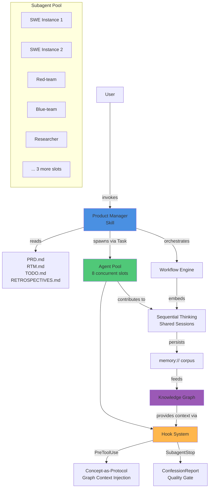
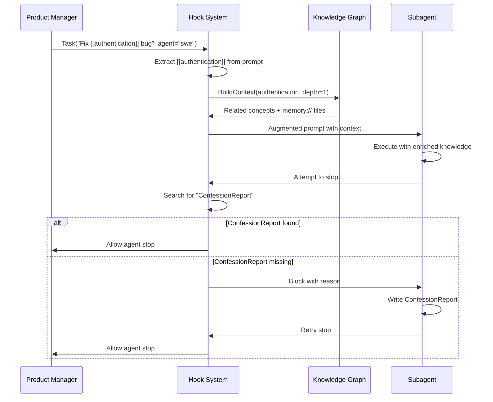
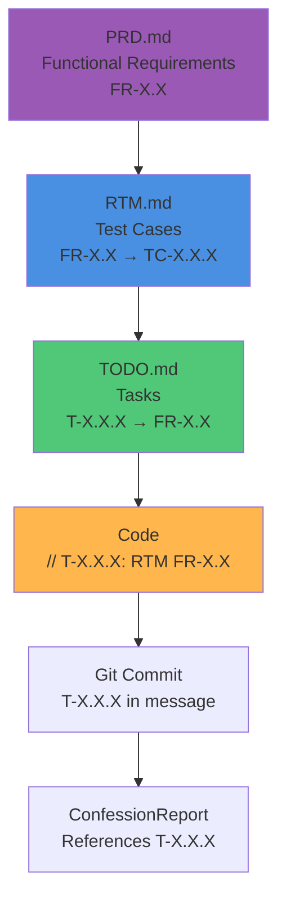
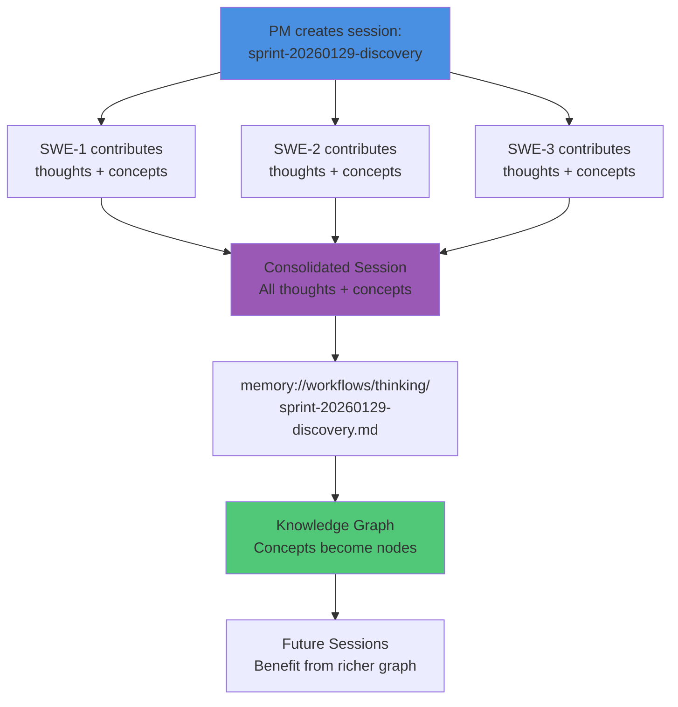
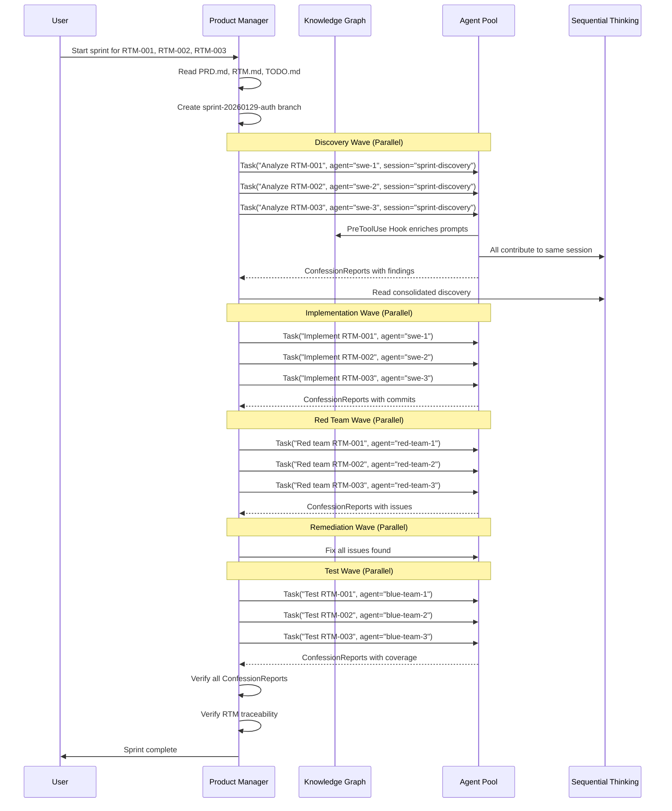

# Product Manager Skill

A multi-agent orchestration system that enables an AI to assume the Product Manager role and coordinate specialized ephemeral subagents (SWE, red-team, blue-team, researcher) to execute software development workflows with full traceability and quality gates.

## Overview

The Product Manager skill transforms Claude Code into a software development team orchestrator. It provides:

- **Multi-agent coordination**: Spawn and manage specialized subagents for development tasks
- **Automatic context injection**: Hook system enriches subagent prompts with graph knowledge
- **Quality gates**: ConfessionReport enforcement ensures accountability and transparency
- **Full traceability**: Every commit traces through PRD → RTM → TODO → code
- **Knowledge graph integration**: All work contributes to institutional memory
- **Wave-based parallelization**: Execute up to 8 concurrent tasks for maximum throughput

## Prerequisites

**REQUIRED**: The maenifold skill must be installed first. The Product Manager skill depends on maenifold's knowledge graph, memory system, and reasoning tools.

Install maenifold skill:
```bash
claude plugin install msbrettorg/maenifold
```

See the [maenifold skill README](../maenifold/README.md) for complete installation instructions.

## Architecture

### System Diagram



### Hook Integration

The hook system provides automatic enhancements to subagent interactions:



## How It Works

### Agent Pool Architecture

The system provides **8 concurrent task slots** that can execute specialized subagents in parallel:

- **SWE**: Software engineer for implementation tasks
- **Red-team**: Security and adversarial testing
- **Blue-team**: Test creation and verification
- **Researcher**: Analysis and investigation

**Key insight**: Think "8 SWE instances" not "1 SWE". Each agent type can be instantiated multiple times for parallel execution.

### Hook Mechanisms

#### 1. Concept-as-Protocol (PreToolUse Hook)

When PM spawns a subagent with `[[concepts]]` in the Task prompt, the PreToolUse hook:

1. Extracts all `[[WikiLink]]` concepts from the prompt
2. Calls `buildcontext` for each concept (depth=1, maxEntities=5)
3. Assembles graph context (up to 8000 tokens total)
4. Injects context into the subagent's prompt before they see it

**Result**: Subagents receive automatic knowledge enrichment without manual searches.

**Token Budget**: 8000 tokens max, 1000 tokens per concept

#### 2. ConfessionReport Gate (SubagentStop Hook)

Every subagent must produce a ConfessionReport before termination. The SubagentStop hook:

1. Intercepts agent termination attempts
2. Searches transcript for "ConfessionReport" string
3. **Blocks** termination if not found, with explanation
4. **Allows** termination if present

**ConfessionReport Structure**:
1. All instructions/constraints/objectives followed
2. Compliance assessment (✅/❌) with evidence
3. Gaps and transparency about limitations
4. Uncertainties, ambiguities, grey areas
5. Shortcuts, hacks, policy risks
6. All files, memory:// URIs, [[concepts]] used

**Purpose**: Ensures accountability, prevents silent failures, enables PM to verify quality.

#### 3. Session Start Context (SessionStart Hook)

On session initialization, automatically inject repository context:

1. Get repository name from git
2. Search memory:// for project-related files
3. Get recent activity concepts (last 24 hours)
4. Build context for top concepts (frequency-ranked)
5. Inject as "Knowledge Graph Context" message

**Token Budget**: 4000 tokens max, 500 tokens per concept (lightweight bootstrap)

### Workflow Patterns

#### Wave-Based Orchestration

Complex work is decomposed into **waves** where multiple agents execute in parallel:

```mermaid
graph LR
    Start[Sprint Start] --> Discovery[Discovery Wave<br/>3 agents parallel]
    Discovery --> Spec[Specs Wave]
    Spec --> RTM[RTM Creation]
    RTM --> UserConfirm[User Confirmation]
    UserConfirm --> Validation[Validation Wave]
    Validation --> ImplPlan[Implementation Planning]
    ImplPlan --> ImplDispatch[Implementation Dispatch<br/>8 agents parallel]
    ImplDispatch --> RedTeam[Red Team Wave<br/>3 agents parallel]
    RedTeam --> Remediation[Remediation Wave]
    Remediation --> ImplVerify[Implementation Verification]
    ImplVerify --> TestWave[Test Wave<br/>3 agents parallel]
    TestWave --> RTMVerify[RTM Verification]
    RTMVerify --> Cleanup[Cleanup Wave]
    Cleanup --> Review[Sprint Review]

    style Discovery fill:#50C878
    style ImplDispatch fill:#50C878
    style RedTeam fill:#FF6B6B
    style TestWave fill:#4A90E2
```



**Key Principle**: Dispatch all agents in **one message** per wave for concurrent execution.

Example:
```
# ✅ Parallel Dispatch (one message)
Task("Analyze RTM-001", agent="swe-1", session="sprint-discovery")
Task("Analyze RTM-002", agent="swe-2", session="sprint-discovery")
Task("Analyze RTM-003", agent="swe-3", session="sprint-discovery")

# ❌ Serial Dispatch (anti-pattern)
Task("Analyze RTM-001", agent="swe")
# wait...
Task("Analyze RTM-002", agent="swe")
# wait...
```

#### Traceability Chain

Every artifact maintains full traceability through the requirements hierarchy:



**Rule**: Work without traceability is rejected.

### Sequential Thinking Collaboration

All agents in a wave can share the same sequential thinking session:



**Benefits**:
- Persistent thought process across ephemeral agents
- Cross-agent visibility and collaboration
- Institutional memory that compounds over time
- Graph building through `[[concepts]]` in thoughts

## Component Overview

### PM Skill (`SKILL.md`)

Entry point that:
- Defines Product Manager responsibilities
- Embeds sprint lifecycle orchestration patterns
- Provides access to maenifold's cognitive stack
- Enforces traceability and quality principles

### Agent Definitions (`/integrations/agents/*.md`)

Each agent has:
- **YAML frontmatter**: Color, skills, description
- **Markdown body**: Role-specific instructions and behavioral guidelines
- **Specialization**: SWE (implementation), red-team (security), blue-team (testing), researcher (analysis)

### Hook System (`/integrations/claude-code/plugin-product-team/hooks/`)

- **`hooks.json`**: Hook configuration (SessionStart, PreToolUse, SubagentStop)
- **`hooks.sh`**: Bash implementation with timeout handling, CLI discovery, concept extraction

### Workflow Assets (`/bin/assets/workflows/*.json`)

Structured JSON workflows that define:
- Step-by-step processes
- Tool hints and metadata
- Stop conditions and guardrails
- Examples: `agentic-slc`, `workflow-dispatch`, `tdd-workflow`

## Execution Flow Example

### Sprint Flow with Wave-Based Orchestration



## Key Principles

### 1. Traceability Everywhere

```
Code → Commit (T-*) → TODO.md (T-* → FR-*) → RTM.md (FR-* → TC-*) → PRD.md (FR-*)
```

Work without traceability is rejected.

### 2. Quality Gates

ConfessionReport requirement ensures:
- Subagents can't silently fail
- Non-compliance is visible
- PM can re-assign work to new instances
- Accountability through transparency

### 3. Parallel by Default

PM always asks: "Could I give this to 8 agents instead of 1?"
- Decompose to file/component/test-suite level
- Dispatch all agents in ONE message per wave
- Maximize throughput, minimize idle time

### 4. SLC Philosophy

Simple, Lovable, Complete:
- No MVPs, scaffolds, stubs, mocks
- Ruthlessly prune non-value-adding work
- Real systems, real data, real artifacts
- Cargo-cult avoidance

### 5. Graph-First Knowledge

Never rely on internal model knowledge:
- Always search graph first (buildcontext, findsimilarconcepts, searchmemories)
- Use external docs when memory:// insufficient
- Write lineage-backed memory:// notes
- Include memory:// URIs in responses

## Installation

### Quick Install

```bash
# Install maenifold plugin (includes Product Manager skill)
claude plugin install msbrettorg/maenifold
```

### Verification

Start Claude Code and invoke the Product Manager skill:

```
Adopt the product manager role and review TODO.md
```

The skill should load automatically and the hook system should be active.

## Configuration

### Hook Configuration

Hooks are configured in `.mcp.json` via the plugin. The default configuration includes:

- **SessionStart**: Automatically load maenifold skill and inject repository context
- **PreToolUse**: Inject graph context when Task includes `[[concepts]]`
- **SubagentStop**: Enforce ConfessionReport before agent termination

### Custom Hook Timeout

Edit `.mcp.json` to adjust hook timeout (default: 5 seconds):

```json
{
  "plugins": {
    "product-team": {
      "hookTimeout": 10000
    }
  }
}
```

## Usage Examples

### Example 1: Simple Bug Fix

```
User: Fix the authentication timeout bug

PM Response:
1. [Spawns researcher with [[authentication]], [[timeout]] concepts]
2. [PreToolUse hook injects graph context]
3. [Researcher produces findings + ConfessionReport]
4. [Spawns SWE with research findings + T-123 identifier]
5. [SWE implements fix, commits with T-123]
6. [Spawns blue-team to verify fix]
7. [Reviews all ConfessionReports, verifies traceability]
```

### Example 2: Multi-Item Sprint

```
User: Start sprint for RTM-001, RTM-002, RTM-003

PM Response:
1. [Creates sprint-20260129-auth branch]
2. Discovery Wave: 3 agents in parallel (all in one message)
3. Implementation Wave: 3 agents in parallel (all in one message)
4. Red Team Wave: 3 agents in parallel (all in one message)
5. Remediation Wave: Fix all issues
6. Test Wave: 3 agents in parallel (all in one message)
7. [Verifies all ConfessionReports and traceability]
```

### Example 3: TDD Workflow

```
User: Implement feature X using TDD workflow

PM Response:
1. Stage 1: SWE defines contract (optional)
2. Stage 2: Blue-team writes tests from RTM
3. Stage 3: SWE implements to pass tests
4. Stage 4: Red-team attacks implementation
5. Stage 5: Blue-team verifies coverage held

[All stages require compliant ConfessionReport]
```

## Troubleshooting

### Hook Latency

**Symptom**: Task invocations take 5-10 seconds
**Cause**: Bash hook queries graph for every Task
**Mitigation**: Hooks have 5-second timeout; failures degrade gracefully

### Agent Blocked by SubagentStop Hook

**Symptom**: Agent can't terminate, receives "ConfessionReport missing" error
**Cause**: Agent didn't write ConfessionReport
**Solution**: Agent must write ConfessionReport including all required sections

### Context Window Overflow

**Symptom**: Large context injections consume token budget
**Cause**: Multiple parallel agents with 8000-token contexts each
**Mitigation**: PreCompact hook saves conversation summary to memory:// before compaction

### Graph Fragmentation

**Symptom**: Context injection returns weak or duplicate concepts
**Cause**: Poor concept tagging (e.g., [[Tool]], [[tool]], [[tools]], [[Tool.cs]])
**Solution**: Use concept repair tools: `analyzeconceptcorruption` → `repairconcepts` with `dryRun=true`

## Limitations

1. **Hook Performance**: 5-10s latency per Task (bash + CLI + graph queries)
2. **Context Budget**: 8000 tokens per Task can accumulate with parallel agents
3. **Pool Limits**: 8 concurrent tasks maximum (requires wave sequencing for larger sprints)
4. **ConfessionReport Enforcement**: Simple string matching (agent could game system)
5. **Graph Fragmentation Risk**: Poor concept tagging dilutes context relevance

## Related Documentation

- [Maenifold Skill README](../maenifold/README.md) - Required prerequisite skill
- [Architecture Analysis](memory://tech/maenifold/product-manager-skill-architecture-analysis) - Complete technical analysis
- [SKILL.md](./SKILL.md) - Skill definition and instructions
- [Agent Definitions](../../agents/) - SWE, red-team, blue-team, researcher
- [Hooks System](../../claude-code/plugin-product-team/hooks/) - Hook implementation

## Source

This documentation is based on analysis of the maenifold codebase at `/Users/brett/src/ma-collective/maenifold`:

- `/integrations/skills/product-manager/SKILL.md`
- `/integrations/agents/*.md`
- `/integrations/claude-code/plugin-product-team/hooks/`
- `/bin/assets/workflows/*.json`

**Date**: 2026-01-29
**Repository**: https://github.com/msbrettorg/maenifold
