# maenifold MCP Server

## Core Function
Cognitive enhancement through interconnected memory, graph, and perspective tools.

## Tool Categories

### Memory System (CRUD)
- **WriteMemory** / **ReadMemory**: Create and access knowledge files
- **EditMemory** / **DeleteMemory** / **MoveMemory**: Evolve understanding
- **Sync**: Update graph database after writes

### Graph System (Query)
- **SearchMemories**: Find knowledge via Hybrid (default), Semantic, or FullText modes
- **BuildContext**: Traverse concept relationships (depth=1-3)
- **FindSimilarConcepts**: Discover semantically related concepts
- **Visualize**: Generate Mermaid diagrams of knowledge networks

### Session Continuity
- **RecentActivity**: Track recent sessions and file changes
- **AssumptionLedger**: Record and verify uncertain claims

### Thinking Tools
- **SequentialThinking**: Iterative reasoning with revision
- **Workflow**: Structured methodologies (30+ workflows)

### Perspectives
- **Adopt**: Professional roles, thinking hats, cognitive lenses

## Usage Pattern
Connect ideas using [[Concept Name]] format. Each reference builds the knowledge graph.

**Example:**
```
I'm analyzing [[Software Architecture Patterns]] and need to compare 
[[Microservices]] vs [[Monoliths]]. Let me search for previous thoughts 
on [[System Design Trade-offs]].
```

## Tool Relationships

```mermaid
graph TD
    subgraph AGENT["AI Agent"]
        LLM[🧠 LLM]
    end

    subgraph PERSP["Perspectives"]
        A[🎭 Adopt]
    end

    subgraph THINK["Thinking"]
        ST[🌊 SequentialThinking]
        WF[📋 Workflow]
        AL[📝 AssumptionLedger]
    end

    subgraph GRAPH["Graph System"]
        SM[🔍 SearchMemories]
        BC[🕸️ BuildContext]
        FS[🔗 FindSimilar]
        VZ[📊 Visualize]
    end

    subgraph MEMORY["Memory System"]
        WM[✍️ Write/Edit]
        RM[📖 Read]
        SY[🔄 Sync]
    end

    A --> LLM
    LLM --> WF & ST
    WF -.-> ST
    ST --> WM & AL
    WF --> WM
    WM --> SY
    SY --> GRAPH
    GRAPH --> LLM
    RM --> LLM
```


**Key principle**: Write with [[concepts]] → Sync → Search/BuildContext → Retrieve. Each memory enriches future searches.